Todo:

1. Problem statement
2. Required extra libraries and their installation instructions
3. Mention that hyper parameter tuning will take time when run


```python
import pandas as pd
import numpy as np
import matplotlib.pyplot as plt
import seaborn as sns
from sklearn import linear_model
from sklearn.model_selection import GridSearchCV
from sklearn.metrics import r2_score


import warnings
warnings.filterwarnings('ignore')
%matplotlib inline
# setting display format so that large values are shown properly
pd.set_option('display.float_format', lambda x: '%.4f' % x)
pd.set_option('display.max_rows', None)
pd.set_option('display.max_columns', None)

sns.set_style(style='dark')
sns.set_context("notebook")
```


```python
telecom_data = pd.read_csv('telecom_churn_data.csv')
```


```python
telecom_data.info()
```

    <class 'pandas.core.frame.DataFrame'>
    RangeIndex: 99999 entries, 0 to 99998
    Columns: 226 entries, mobile_number to sep_vbc_3g
    dtypes: float64(179), int64(35), object(12)
    memory usage: 172.4+ MB


```python
def get_columns_with_nan_percentage(df):
    nan_cols = [{
        "column":
        c,
        "percentage":
        round(100 * (df[c].isnull().sum() / len(df[c].index)), 2),
        "type":
        df[c].dtype
    } for c in df.columns
                if round(100 *
                         (df[c].isnull().sum() / len(df[c].index)), 2) > 0]
    
    if len(nan_cols)>0:
        return pd.DataFrame.from_records(nan_cols).sort_values(by=['percentage'],
                                                           ascending=False)
    else:
        return pd.DataFrame.from_records(nan_cols)


def convert_to_category(columns):
    for column in columns:
        telecom_data[column] = telecom_data[column].astype('object')


def get_int_float_columns_with_Zero_percentage(df):
    nan_cols = [{
        "column":
        c,
        "percentage":
        round(100 * ((df[c] == 0).sum() / len(df[c].index)), 2),
        "type":
        df[c].dtype
    } for c in df.columns
                if round(100 *
                         ((df[c] == 0).sum().sum() / len(df[c].index)), 2) > 0]
    return pd.DataFrame.from_records(nan_cols)


def get_columns_with_similar_values(df, threshold):
    columns_to_delete = []
    for c in df.columns:
        if (any(y >= threshold for y in df[c].value_counts(
                dropna=False, normalize=True).tolist())):
            columns_to_delete.append(c)
    return columns_to_delete
```

## High value customers

In order to identify the high value customer, we need to find the customers who spent the most. For this we will use 
```
total_rech_data_6, av_rech_amt_data_6, total_rech_data_7 , av_rech_amt_data_7, total_rech_amt_6 and total_rech_amt_7
```


```python
columns_high_value_calculation= ['total_rech_data_6', 'av_rech_amt_data_6', 'total_rech_data_7' , 'av_rech_amt_data_7', 'total_rech_amt_6', 'total_rech_amt_7']

telecom_data[columns_high_value_calculation].describe()
```


<div>
<style scoped>
    .dataframe tbody tr th:only-of-type {
        vertical-align: middle;
    }

    .dataframe tbody tr th {
        vertical-align: top;
    }

    .dataframe thead th {
        text-align: right;
    }
</style>
<table border="1" class="dataframe">
  <thead>
    <tr style="text-align: right;">
      <th></th>
      <th>total_rech_data_6</th>
      <th>av_rech_amt_data_6</th>
      <th>total_rech_data_7</th>
      <th>av_rech_amt_data_7</th>
      <th>total_rech_amt_6</th>
      <th>total_rech_amt_7</th>
    </tr>
  </thead>
  <tbody>
    <tr>
      <td>count</td>
      <td>25153.0000</td>
      <td>25153.0000</td>
      <td>25571.0000</td>
      <td>25571.0000</td>
      <td>99999.0000</td>
      <td>99999.0000</td>
    </tr>
    <tr>
      <td>mean</td>
      <td>2.4638</td>
      <td>192.6010</td>
      <td>2.6664</td>
      <td>200.9813</td>
      <td>327.5146</td>
      <td>322.9630</td>
    </tr>
    <tr>
      <td>std</td>
      <td>2.7891</td>
      <td>192.6463</td>
      <td>3.0316</td>
      <td>196.7912</td>
      <td>398.0197</td>
      <td>408.1142</td>
    </tr>
    <tr>
      <td>min</td>
      <td>1.0000</td>
      <td>1.0000</td>
      <td>1.0000</td>
      <td>0.5000</td>
      <td>0.0000</td>
      <td>0.0000</td>
    </tr>
    <tr>
      <td>25%</td>
      <td>1.0000</td>
      <td>82.0000</td>
      <td>1.0000</td>
      <td>92.0000</td>
      <td>109.0000</td>
      <td>100.0000</td>
    </tr>
    <tr>
      <td>50%</td>
      <td>1.0000</td>
      <td>154.0000</td>
      <td>1.0000</td>
      <td>154.0000</td>
      <td>230.0000</td>
      <td>220.0000</td>
    </tr>
    <tr>
      <td>75%</td>
      <td>3.0000</td>
      <td>252.0000</td>
      <td>3.0000</td>
      <td>252.0000</td>
      <td>437.5000</td>
      <td>428.0000</td>
    </tr>
    <tr>
      <td>max</td>
      <td>61.0000</td>
      <td>7546.0000</td>
      <td>54.0000</td>
      <td>4365.0000</td>
      <td>35190.0000</td>
      <td>40335.0000</td>
    </tr>
  </tbody>
</table>
</div>


```python
nan_df = get_columns_with_nan_percentage(telecom_data[columns_high_value_calculation])
nan_df
```


<div>
<style scoped>
    .dataframe tbody tr th:only-of-type {
        vertical-align: middle;
    }

    .dataframe tbody tr th {
        vertical-align: top;
    }

    .dataframe thead th {
        text-align: right;
    }
</style>
<table border="1" class="dataframe">
  <thead>
    <tr style="text-align: right;">
      <th></th>
      <th>column</th>
      <th>percentage</th>
      <th>type</th>
    </tr>
  </thead>
  <tbody>
    <tr>
      <td>0</td>
      <td>total_rech_data_6</td>
      <td>74.8500</td>
      <td>float64</td>
    </tr>
    <tr>
      <td>1</td>
      <td>av_rech_amt_data_6</td>
      <td>74.8500</td>
      <td>float64</td>
    </tr>
    <tr>
      <td>2</td>
      <td>total_rech_data_7</td>
      <td>74.4300</td>
      <td>float64</td>
    </tr>
    <tr>
      <td>3</td>
      <td>av_rech_amt_data_7</td>
      <td>74.4300</td>
      <td>float64</td>
    </tr>
  </tbody>
</table>
</div>


If we see the minimum for each type of column, we can see it is 1. So, we can put 0 in case of NAN for the customers


```python
telecom_data[columns_high_value_calculation] = telecom_data[columns_high_value_calculation].fillna(0)
```


```python
# Similarly, we can also put 0 for month 8
telecom_data[['total_rech_data_8', 'av_rech_amt_data_8','total_rech_amt_8']] = telecom_data[['total_rech_data_8', 'av_rech_amt_data_8','total_rech_amt_8']].fillna(0)
```


```python
def get_average_recharge(row):
    amount = 0.0
    amount += row['total_rech_data_6'] * row['av_rech_amt_data_6']
    amount += row['total_rech_data_7'] * row['av_rech_amt_data_7']
    amount += row['total_rech_amt_6']
    amount += row['total_rech_amt_7']

    return amount / 2.0


telecom_data['average_recharge_amount'] = telecom_data.apply(
    get_average_recharge, axis=1)
```


```python
percentile_70 = telecom_data['average_recharge_amount'].quantile(.7)
percentile_70
```


    478.0


```python
# As per the problem statement, we need to consider customers as high value if they have more than 70 percentile expense

def check_high_value_customer(row):
    return 1 if row['average_recharge_amount'] > percentile_70 else 0


telecom_data['high_value_customer'] = telecom_data.apply(
    check_high_value_customer, axis=1)
```


```python
telecom_data['high_value_customer'].value_counts()
```


    0    70046
    1    29953
    Name: high_value_customer, dtype: int64


We can see that there are **29953** high value customer. From now onwards, we will only consider these customers for further analysis.


```python
# Getting all the high value customers
telecom_data = telecom_data[telecom_data['high_value_customer'] == 1]
```


```python
telecom_data.info()
```

    <class 'pandas.core.frame.DataFrame'>
    Int64Index: 29953 entries, 0 to 99997
    Columns: 228 entries, mobile_number to high_value_customer
    dtypes: float64(180), int64(36), object(12)
    memory usage: 52.3+ MB


## Churned customers


```python
def check_churn(row):
     return 1 if (row['total_ic_mou_9'] == 0 and row['total_og_mou_9'] == 0 and row['vol_2g_mb_9'] == 0 and row['vol_3g_mb_9'] == 0)  else 0

telecom_data['churn'] = telecom_data.apply(check_churn, axis=1)
telecom_data['churn'] = telecom_data['churn'].astype('category')
```


```python
telecom_data['churn'].value_counts()
```


    0    27520
    1     2433
    Name: churn, dtype: int64


Now we will delete columns for **September**


```python
def get_columns_by_pattern(df,func):
    return [c for c in telecom_data.columns if func(c)]

telecom_data = telecom_data.drop('sep_vbc_3g',axis=1)
```


```python
columns_to_drop = get_columns_by_pattern(telecom_data,
                                       lambda x: x.endswith("_9"))
telecom_data = telecom_data.drop(columns_to_drop, axis=1)
```


```python
# We can delete the mobile number column as it will not help in analysis
telecom_data = telecom_data.drop('mobile_number',axis=1)
```


```python
nan_df = get_columns_with_nan_percentage(telecom_data)
nan_df
```


<div>
<style scoped>
    .dataframe tbody tr th:only-of-type {
        vertical-align: middle;
    }

    .dataframe tbody tr th {
        vertical-align: top;
    }

    .dataframe thead th {
        text-align: right;
    }
</style>
<table border="1" class="dataframe">
  <thead>
    <tr style="text-align: right;">
      <th></th>
      <th>column</th>
      <th>percentage</th>
      <th>type</th>
    </tr>
  </thead>
  <tbody>
    <tr>
      <td>118</td>
      <td>fb_user_8</td>
      <td>46.8000</td>
      <td>float64</td>
    </tr>
    <tr>
      <td>112</td>
      <td>arpu_2g_8</td>
      <td>46.8000</td>
      <td>float64</td>
    </tr>
    <tr>
      <td>100</td>
      <td>max_rech_data_8</td>
      <td>46.8000</td>
      <td>float64</td>
    </tr>
    <tr>
      <td>103</td>
      <td>count_rech_2g_8</td>
      <td>46.8000</td>
      <td>float64</td>
    </tr>
    <tr>
      <td>106</td>
      <td>count_rech_3g_8</td>
      <td>46.8000</td>
      <td>float64</td>
    </tr>
    <tr>
      <td>109</td>
      <td>arpu_3g_8</td>
      <td>46.8000</td>
      <td>float64</td>
    </tr>
    <tr>
      <td>97</td>
      <td>date_of_last_rech_data_8</td>
      <td>46.8000</td>
      <td>object</td>
    </tr>
    <tr>
      <td>115</td>
      <td>night_pck_user_8</td>
      <td>46.8000</td>
      <td>float64</td>
    </tr>
    <tr>
      <td>116</td>
      <td>fb_user_6</td>
      <td>44.1100</td>
      <td>float64</td>
    </tr>
    <tr>
      <td>110</td>
      <td>arpu_2g_6</td>
      <td>44.1100</td>
      <td>float64</td>
    </tr>
    <tr>
      <td>101</td>
      <td>count_rech_2g_6</td>
      <td>44.1100</td>
      <td>float64</td>
    </tr>
    <tr>
      <td>98</td>
      <td>max_rech_data_6</td>
      <td>44.1100</td>
      <td>float64</td>
    </tr>
    <tr>
      <td>107</td>
      <td>arpu_3g_6</td>
      <td>44.1100</td>
      <td>float64</td>
    </tr>
    <tr>
      <td>113</td>
      <td>night_pck_user_6</td>
      <td>44.1100</td>
      <td>float64</td>
    </tr>
    <tr>
      <td>95</td>
      <td>date_of_last_rech_data_6</td>
      <td>44.1100</td>
      <td>object</td>
    </tr>
    <tr>
      <td>104</td>
      <td>count_rech_3g_6</td>
      <td>44.1100</td>
      <td>float64</td>
    </tr>
    <tr>
      <td>105</td>
      <td>count_rech_3g_7</td>
      <td>43.1200</td>
      <td>float64</td>
    </tr>
    <tr>
      <td>99</td>
      <td>max_rech_data_7</td>
      <td>43.1200</td>
      <td>float64</td>
    </tr>
    <tr>
      <td>117</td>
      <td>fb_user_7</td>
      <td>43.1200</td>
      <td>float64</td>
    </tr>
    <tr>
      <td>102</td>
      <td>count_rech_2g_7</td>
      <td>43.1200</td>
      <td>float64</td>
    </tr>
    <tr>
      <td>96</td>
      <td>date_of_last_rech_data_7</td>
      <td>43.1200</td>
      <td>object</td>
    </tr>
    <tr>
      <td>108</td>
      <td>arpu_3g_7</td>
      <td>43.1200</td>
      <td>float64</td>
    </tr>
    <tr>
      <td>114</td>
      <td>night_pck_user_7</td>
      <td>43.1200</td>
      <td>float64</td>
    </tr>
    <tr>
      <td>111</td>
      <td>arpu_2g_7</td>
      <td>43.1200</td>
      <td>float64</td>
    </tr>
    <tr>
      <td>79</td>
      <td>std_ic_t2o_mou_8</td>
      <td>3.9100</td>
      <td>float64</td>
    </tr>
    <tr>
      <td>46</td>
      <td>std_og_mou_8</td>
      <td>3.9100</td>
      <td>float64</td>
    </tr>
    <tr>
      <td>49</td>
      <td>isd_og_mou_8</td>
      <td>3.9100</td>
      <td>float64</td>
    </tr>
    <tr>
      <td>82</td>
      <td>std_ic_mou_8</td>
      <td>3.9100</td>
      <td>float64</td>
    </tr>
    <tr>
      <td>43</td>
      <td>std_og_t2c_mou_8</td>
      <td>3.9100</td>
      <td>float64</td>
    </tr>
    <tr>
      <td>55</td>
      <td>og_others_8</td>
      <td>3.9100</td>
      <td>float64</td>
    </tr>
    <tr>
      <td>76</td>
      <td>std_ic_t2f_mou_8</td>
      <td>3.9100</td>
      <td>float64</td>
    </tr>
    <tr>
      <td>52</td>
      <td>spl_og_mou_8</td>
      <td>3.9100</td>
      <td>float64</td>
    </tr>
    <tr>
      <td>73</td>
      <td>std_ic_t2m_mou_8</td>
      <td>3.9100</td>
      <td>float64</td>
    </tr>
    <tr>
      <td>40</td>
      <td>std_og_t2f_mou_8</td>
      <td>3.9100</td>
      <td>float64</td>
    </tr>
    <tr>
      <td>70</td>
      <td>std_ic_t2t_mou_8</td>
      <td>3.9100</td>
      <td>float64</td>
    </tr>
    <tr>
      <td>58</td>
      <td>loc_ic_t2t_mou_8</td>
      <td>3.9100</td>
      <td>float64</td>
    </tr>
    <tr>
      <td>67</td>
      <td>loc_ic_mou_8</td>
      <td>3.9100</td>
      <td>float64</td>
    </tr>
    <tr>
      <td>61</td>
      <td>loc_ic_t2m_mou_8</td>
      <td>3.9100</td>
      <td>float64</td>
    </tr>
    <tr>
      <td>85</td>
      <td>spl_ic_mou_8</td>
      <td>3.9100</td>
      <td>float64</td>
    </tr>
    <tr>
      <td>31</td>
      <td>loc_og_mou_8</td>
      <td>3.9100</td>
      <td>float64</td>
    </tr>
    <tr>
      <td>88</td>
      <td>isd_ic_mou_8</td>
      <td>3.9100</td>
      <td>float64</td>
    </tr>
    <tr>
      <td>64</td>
      <td>loc_ic_t2f_mou_8</td>
      <td>3.9100</td>
      <td>float64</td>
    </tr>
    <tr>
      <td>7</td>
      <td>onnet_mou_8</td>
      <td>3.9100</td>
      <td>float64</td>
    </tr>
    <tr>
      <td>10</td>
      <td>offnet_mou_8</td>
      <td>3.9100</td>
      <td>float64</td>
    </tr>
    <tr>
      <td>13</td>
      <td>roam_ic_mou_8</td>
      <td>3.9100</td>
      <td>float64</td>
    </tr>
    <tr>
      <td>16</td>
      <td>roam_og_mou_8</td>
      <td>3.9100</td>
      <td>float64</td>
    </tr>
    <tr>
      <td>19</td>
      <td>loc_og_t2t_mou_8</td>
      <td>3.9100</td>
      <td>float64</td>
    </tr>
    <tr>
      <td>22</td>
      <td>loc_og_t2m_mou_8</td>
      <td>3.9100</td>
      <td>float64</td>
    </tr>
    <tr>
      <td>25</td>
      <td>loc_og_t2f_mou_8</td>
      <td>3.9100</td>
      <td>float64</td>
    </tr>
    <tr>
      <td>28</td>
      <td>loc_og_t2c_mou_8</td>
      <td>3.9100</td>
      <td>float64</td>
    </tr>
    <tr>
      <td>34</td>
      <td>std_og_t2t_mou_8</td>
      <td>3.9100</td>
      <td>float64</td>
    </tr>
    <tr>
      <td>91</td>
      <td>ic_others_8</td>
      <td>3.9100</td>
      <td>float64</td>
    </tr>
    <tr>
      <td>37</td>
      <td>std_og_t2m_mou_8</td>
      <td>3.9100</td>
      <td>float64</td>
    </tr>
    <tr>
      <td>94</td>
      <td>date_of_last_rech_8</td>
      <td>1.9400</td>
      <td>object</td>
    </tr>
    <tr>
      <td>77</td>
      <td>std_ic_t2o_mou_6</td>
      <td>1.8100</td>
      <td>float64</td>
    </tr>
    <tr>
      <td>86</td>
      <td>isd_ic_mou_6</td>
      <td>1.8100</td>
      <td>float64</td>
    </tr>
    <tr>
      <td>74</td>
      <td>std_ic_t2f_mou_6</td>
      <td>1.8100</td>
      <td>float64</td>
    </tr>
    <tr>
      <td>80</td>
      <td>std_ic_mou_6</td>
      <td>1.8100</td>
      <td>float64</td>
    </tr>
    <tr>
      <td>71</td>
      <td>std_ic_t2m_mou_6</td>
      <td>1.8100</td>
      <td>float64</td>
    </tr>
    <tr>
      <td>83</td>
      <td>spl_ic_mou_6</td>
      <td>1.8100</td>
      <td>float64</td>
    </tr>
    <tr>
      <td>68</td>
      <td>std_ic_t2t_mou_6</td>
      <td>1.8100</td>
      <td>float64</td>
    </tr>
    <tr>
      <td>89</td>
      <td>ic_others_6</td>
      <td>1.8100</td>
      <td>float64</td>
    </tr>
    <tr>
      <td>65</td>
      <td>loc_ic_mou_6</td>
      <td>1.8100</td>
      <td>float64</td>
    </tr>
    <tr>
      <td>59</td>
      <td>loc_ic_t2m_mou_6</td>
      <td>1.8100</td>
      <td>float64</td>
    </tr>
    <tr>
      <td>20</td>
      <td>loc_og_t2m_mou_6</td>
      <td>1.8100</td>
      <td>float64</td>
    </tr>
    <tr>
      <td>26</td>
      <td>loc_og_t2c_mou_6</td>
      <td>1.8100</td>
      <td>float64</td>
    </tr>
    <tr>
      <td>44</td>
      <td>std_og_mou_6</td>
      <td>1.8100</td>
      <td>float64</td>
    </tr>
    <tr>
      <td>23</td>
      <td>loc_og_t2f_mou_6</td>
      <td>1.8100</td>
      <td>float64</td>
    </tr>
    <tr>
      <td>47</td>
      <td>isd_og_mou_6</td>
      <td>1.8100</td>
      <td>float64</td>
    </tr>
    <tr>
      <td>35</td>
      <td>std_og_t2m_mou_6</td>
      <td>1.8100</td>
      <td>float64</td>
    </tr>
    <tr>
      <td>29</td>
      <td>loc_og_mou_6</td>
      <td>1.8100</td>
      <td>float64</td>
    </tr>
    <tr>
      <td>50</td>
      <td>spl_og_mou_6</td>
      <td>1.8100</td>
      <td>float64</td>
    </tr>
    <tr>
      <td>17</td>
      <td>loc_og_t2t_mou_6</td>
      <td>1.8100</td>
      <td>float64</td>
    </tr>
    <tr>
      <td>38</td>
      <td>std_og_t2f_mou_6</td>
      <td>1.8100</td>
      <td>float64</td>
    </tr>
    <tr>
      <td>53</td>
      <td>og_others_6</td>
      <td>1.8100</td>
      <td>float64</td>
    </tr>
    <tr>
      <td>14</td>
      <td>roam_og_mou_6</td>
      <td>1.8100</td>
      <td>float64</td>
    </tr>
    <tr>
      <td>56</td>
      <td>loc_ic_t2t_mou_6</td>
      <td>1.8100</td>
      <td>float64</td>
    </tr>
    <tr>
      <td>11</td>
      <td>roam_ic_mou_6</td>
      <td>1.8100</td>
      <td>float64</td>
    </tr>
    <tr>
      <td>62</td>
      <td>loc_ic_t2f_mou_6</td>
      <td>1.8100</td>
      <td>float64</td>
    </tr>
    <tr>
      <td>8</td>
      <td>offnet_mou_6</td>
      <td>1.8100</td>
      <td>float64</td>
    </tr>
    <tr>
      <td>32</td>
      <td>std_og_t2t_mou_6</td>
      <td>1.8100</td>
      <td>float64</td>
    </tr>
    <tr>
      <td>5</td>
      <td>onnet_mou_6</td>
      <td>1.8100</td>
      <td>float64</td>
    </tr>
    <tr>
      <td>41</td>
      <td>std_og_t2c_mou_6</td>
      <td>1.8100</td>
      <td>float64</td>
    </tr>
    <tr>
      <td>30</td>
      <td>loc_og_mou_7</td>
      <td>1.7900</td>
      <td>float64</td>
    </tr>
    <tr>
      <td>27</td>
      <td>loc_og_t2c_mou_7</td>
      <td>1.7900</td>
      <td>float64</td>
    </tr>
    <tr>
      <td>63</td>
      <td>loc_ic_t2f_mou_7</td>
      <td>1.7900</td>
      <td>float64</td>
    </tr>
    <tr>
      <td>24</td>
      <td>loc_og_t2f_mou_7</td>
      <td>1.7900</td>
      <td>float64</td>
    </tr>
    <tr>
      <td>21</td>
      <td>loc_og_t2m_mou_7</td>
      <td>1.7900</td>
      <td>float64</td>
    </tr>
    <tr>
      <td>18</td>
      <td>loc_og_t2t_mou_7</td>
      <td>1.7900</td>
      <td>float64</td>
    </tr>
    <tr>
      <td>15</td>
      <td>roam_og_mou_7</td>
      <td>1.7900</td>
      <td>float64</td>
    </tr>
    <tr>
      <td>12</td>
      <td>roam_ic_mou_7</td>
      <td>1.7900</td>
      <td>float64</td>
    </tr>
    <tr>
      <td>9</td>
      <td>offnet_mou_7</td>
      <td>1.7900</td>
      <td>float64</td>
    </tr>
    <tr>
      <td>6</td>
      <td>onnet_mou_7</td>
      <td>1.7900</td>
      <td>float64</td>
    </tr>
    <tr>
      <td>33</td>
      <td>std_og_t2t_mou_7</td>
      <td>1.7900</td>
      <td>float64</td>
    </tr>
    <tr>
      <td>36</td>
      <td>std_og_t2m_mou_7</td>
      <td>1.7900</td>
      <td>float64</td>
    </tr>
    <tr>
      <td>75</td>
      <td>std_ic_t2f_mou_7</td>
      <td>1.7900</td>
      <td>float64</td>
    </tr>
    <tr>
      <td>60</td>
      <td>loc_ic_t2m_mou_7</td>
      <td>1.7900</td>
      <td>float64</td>
    </tr>
    <tr>
      <td>69</td>
      <td>std_ic_t2t_mou_7</td>
      <td>1.7900</td>
      <td>float64</td>
    </tr>
    <tr>
      <td>57</td>
      <td>loc_ic_t2t_mou_7</td>
      <td>1.7900</td>
      <td>float64</td>
    </tr>
    <tr>
      <td>72</td>
      <td>std_ic_t2m_mou_7</td>
      <td>1.7900</td>
      <td>float64</td>
    </tr>
    <tr>
      <td>54</td>
      <td>og_others_7</td>
      <td>1.7900</td>
      <td>float64</td>
    </tr>
    <tr>
      <td>51</td>
      <td>spl_og_mou_7</td>
      <td>1.7900</td>
      <td>float64</td>
    </tr>
    <tr>
      <td>78</td>
      <td>std_ic_t2o_mou_7</td>
      <td>1.7900</td>
      <td>float64</td>
    </tr>
    <tr>
      <td>48</td>
      <td>isd_og_mou_7</td>
      <td>1.7900</td>
      <td>float64</td>
    </tr>
    <tr>
      <td>81</td>
      <td>std_ic_mou_7</td>
      <td>1.7900</td>
      <td>float64</td>
    </tr>
    <tr>
      <td>45</td>
      <td>std_og_mou_7</td>
      <td>1.7900</td>
      <td>float64</td>
    </tr>
    <tr>
      <td>84</td>
      <td>spl_ic_mou_7</td>
      <td>1.7900</td>
      <td>float64</td>
    </tr>
    <tr>
      <td>42</td>
      <td>std_og_t2c_mou_7</td>
      <td>1.7900</td>
      <td>float64</td>
    </tr>
    <tr>
      <td>87</td>
      <td>isd_ic_mou_7</td>
      <td>1.7900</td>
      <td>float64</td>
    </tr>
    <tr>
      <td>39</td>
      <td>std_og_t2f_mou_7</td>
      <td>1.7900</td>
      <td>float64</td>
    </tr>
    <tr>
      <td>90</td>
      <td>ic_others_7</td>
      <td>1.7900</td>
      <td>float64</td>
    </tr>
    <tr>
      <td>66</td>
      <td>loc_ic_mou_7</td>
      <td>1.7900</td>
      <td>float64</td>
    </tr>
    <tr>
      <td>2</td>
      <td>loc_ic_t2o_mou</td>
      <td>0.7400</td>
      <td>float64</td>
    </tr>
    <tr>
      <td>0</td>
      <td>loc_og_t2o_mou</td>
      <td>0.7400</td>
      <td>float64</td>
    </tr>
    <tr>
      <td>1</td>
      <td>std_og_t2o_mou</td>
      <td>0.7400</td>
      <td>float64</td>
    </tr>
    <tr>
      <td>4</td>
      <td>last_date_of_month_8</td>
      <td>0.5500</td>
      <td>object</td>
    </tr>
    <tr>
      <td>93</td>
      <td>date_of_last_rech_7</td>
      <td>0.3300</td>
      <td>object</td>
    </tr>
    <tr>
      <td>92</td>
      <td>date_of_last_rech_6</td>
      <td>0.2400</td>
      <td>object</td>
    </tr>
    <tr>
      <td>3</td>
      <td>last_date_of_month_7</td>
      <td>0.0900</td>
      <td>object</td>
    </tr>
  </tbody>
</table>
</div>


Among the columns, following are categorical columns
```
fb_user_6,fb_user_7,fb_user_8,night_pck_user_6,night_pck_user_7,night_pck_user_8
```


```python
categorical_columns = ['fb_user_6','fb_user_7','fb_user_8','night_pck_user_6','night_pck_user_7','night_pck_user_8']
```


```python
# We will put -1 as a new category for the null in the above mentioned columns.

telecom_data[categorical_columns] = telecom_data[categorical_columns].fillna(-1)
telecom_data[categorical_columns] = telecom_data[categorical_columns].astype('int').astype('category')
```


```python
telecom_data.describe()
```


<div>
<style scoped>
    .dataframe tbody tr th:only-of-type {
        vertical-align: middle;
    }

    .dataframe tbody tr th {
        vertical-align: top;
    }

    .dataframe thead th {
        text-align: right;
    }
</style>
<table border="1" class="dataframe">
  <thead>
    <tr style="text-align: right;">
      <th></th>
      <th>circle_id</th>
      <th>loc_og_t2o_mou</th>
      <th>std_og_t2o_mou</th>
      <th>loc_ic_t2o_mou</th>
      <th>arpu_6</th>
      <th>arpu_7</th>
      <th>arpu_8</th>
      <th>onnet_mou_6</th>
      <th>onnet_mou_7</th>
      <th>onnet_mou_8</th>
      <th>offnet_mou_6</th>
      <th>offnet_mou_7</th>
      <th>offnet_mou_8</th>
      <th>roam_ic_mou_6</th>
      <th>roam_ic_mou_7</th>
      <th>roam_ic_mou_8</th>
      <th>roam_og_mou_6</th>
      <th>roam_og_mou_7</th>
      <th>roam_og_mou_8</th>
      <th>loc_og_t2t_mou_6</th>
      <th>loc_og_t2t_mou_7</th>
      <th>loc_og_t2t_mou_8</th>
      <th>loc_og_t2m_mou_6</th>
      <th>loc_og_t2m_mou_7</th>
      <th>loc_og_t2m_mou_8</th>
      <th>loc_og_t2f_mou_6</th>
      <th>loc_og_t2f_mou_7</th>
      <th>loc_og_t2f_mou_8</th>
      <th>loc_og_t2c_mou_6</th>
      <th>loc_og_t2c_mou_7</th>
      <th>loc_og_t2c_mou_8</th>
      <th>loc_og_mou_6</th>
      <th>loc_og_mou_7</th>
      <th>loc_og_mou_8</th>
      <th>std_og_t2t_mou_6</th>
      <th>std_og_t2t_mou_7</th>
      <th>std_og_t2t_mou_8</th>
      <th>std_og_t2m_mou_6</th>
      <th>std_og_t2m_mou_7</th>
      <th>std_og_t2m_mou_8</th>
      <th>std_og_t2f_mou_6</th>
      <th>std_og_t2f_mou_7</th>
      <th>std_og_t2f_mou_8</th>
      <th>std_og_t2c_mou_6</th>
      <th>std_og_t2c_mou_7</th>
      <th>std_og_t2c_mou_8</th>
      <th>std_og_mou_6</th>
      <th>std_og_mou_7</th>
      <th>std_og_mou_8</th>
      <th>isd_og_mou_6</th>
      <th>isd_og_mou_7</th>
      <th>isd_og_mou_8</th>
      <th>spl_og_mou_6</th>
      <th>spl_og_mou_7</th>
      <th>spl_og_mou_8</th>
      <th>og_others_6</th>
      <th>og_others_7</th>
      <th>og_others_8</th>
      <th>total_og_mou_6</th>
      <th>total_og_mou_7</th>
      <th>total_og_mou_8</th>
      <th>loc_ic_t2t_mou_6</th>
      <th>loc_ic_t2t_mou_7</th>
      <th>loc_ic_t2t_mou_8</th>
      <th>loc_ic_t2m_mou_6</th>
      <th>loc_ic_t2m_mou_7</th>
      <th>loc_ic_t2m_mou_8</th>
      <th>loc_ic_t2f_mou_6</th>
      <th>loc_ic_t2f_mou_7</th>
      <th>loc_ic_t2f_mou_8</th>
      <th>loc_ic_mou_6</th>
      <th>loc_ic_mou_7</th>
      <th>loc_ic_mou_8</th>
      <th>std_ic_t2t_mou_6</th>
      <th>std_ic_t2t_mou_7</th>
      <th>std_ic_t2t_mou_8</th>
      <th>std_ic_t2m_mou_6</th>
      <th>std_ic_t2m_mou_7</th>
      <th>std_ic_t2m_mou_8</th>
      <th>std_ic_t2f_mou_6</th>
      <th>std_ic_t2f_mou_7</th>
      <th>std_ic_t2f_mou_8</th>
      <th>std_ic_t2o_mou_6</th>
      <th>std_ic_t2o_mou_7</th>
      <th>std_ic_t2o_mou_8</th>
      <th>std_ic_mou_6</th>
      <th>std_ic_mou_7</th>
      <th>std_ic_mou_8</th>
      <th>total_ic_mou_6</th>
      <th>total_ic_mou_7</th>
      <th>total_ic_mou_8</th>
      <th>spl_ic_mou_6</th>
      <th>spl_ic_mou_7</th>
      <th>spl_ic_mou_8</th>
      <th>isd_ic_mou_6</th>
      <th>isd_ic_mou_7</th>
      <th>isd_ic_mou_8</th>
      <th>ic_others_6</th>
      <th>ic_others_7</th>
      <th>ic_others_8</th>
      <th>total_rech_num_6</th>
      <th>total_rech_num_7</th>
      <th>total_rech_num_8</th>
      <th>total_rech_amt_6</th>
      <th>total_rech_amt_7</th>
      <th>total_rech_amt_8</th>
      <th>max_rech_amt_6</th>
      <th>max_rech_amt_7</th>
      <th>max_rech_amt_8</th>
      <th>last_day_rch_amt_6</th>
      <th>last_day_rch_amt_7</th>
      <th>last_day_rch_amt_8</th>
      <th>total_rech_data_6</th>
      <th>total_rech_data_7</th>
      <th>total_rech_data_8</th>
      <th>max_rech_data_6</th>
      <th>max_rech_data_7</th>
      <th>max_rech_data_8</th>
      <th>count_rech_2g_6</th>
      <th>count_rech_2g_7</th>
      <th>count_rech_2g_8</th>
      <th>count_rech_3g_6</th>
      <th>count_rech_3g_7</th>
      <th>count_rech_3g_8</th>
      <th>av_rech_amt_data_6</th>
      <th>av_rech_amt_data_7</th>
      <th>av_rech_amt_data_8</th>
      <th>vol_2g_mb_6</th>
      <th>vol_2g_mb_7</th>
      <th>vol_2g_mb_8</th>
      <th>vol_3g_mb_6</th>
      <th>vol_3g_mb_7</th>
      <th>vol_3g_mb_8</th>
      <th>arpu_3g_6</th>
      <th>arpu_3g_7</th>
      <th>arpu_3g_8</th>
      <th>arpu_2g_6</th>
      <th>arpu_2g_7</th>
      <th>arpu_2g_8</th>
      <th>monthly_2g_6</th>
      <th>monthly_2g_7</th>
      <th>monthly_2g_8</th>
      <th>sachet_2g_6</th>
      <th>sachet_2g_7</th>
      <th>sachet_2g_8</th>
      <th>monthly_3g_6</th>
      <th>monthly_3g_7</th>
      <th>monthly_3g_8</th>
      <th>sachet_3g_6</th>
      <th>sachet_3g_7</th>
      <th>sachet_3g_8</th>
      <th>aon</th>
      <th>aug_vbc_3g</th>
      <th>jul_vbc_3g</th>
      <th>jun_vbc_3g</th>
      <th>average_recharge_amount</th>
      <th>high_value_customer</th>
    </tr>
  </thead>
  <tbody>
    <tr>
      <td>count</td>
      <td>29953.0000</td>
      <td>29730.0000</td>
      <td>29730.0000</td>
      <td>29730.0000</td>
      <td>29953.0000</td>
      <td>29953.0000</td>
      <td>29953.0000</td>
      <td>29411.0000</td>
      <td>29417.0000</td>
      <td>28781.0000</td>
      <td>29411.0000</td>
      <td>29417.0000</td>
      <td>28781.0000</td>
      <td>29411.0000</td>
      <td>29417.0000</td>
      <td>28781.0000</td>
      <td>29411.0000</td>
      <td>29417.0000</td>
      <td>28781.0000</td>
      <td>29411.0000</td>
      <td>29417.0000</td>
      <td>28781.0000</td>
      <td>29411.0000</td>
      <td>29417.0000</td>
      <td>28781.0000</td>
      <td>29411.0000</td>
      <td>29417.0000</td>
      <td>28781.0000</td>
      <td>29411.0000</td>
      <td>29417.0000</td>
      <td>28781.0000</td>
      <td>29411.0000</td>
      <td>29417.0000</td>
      <td>28781.0000</td>
      <td>29411.0000</td>
      <td>29417.0000</td>
      <td>28781.0000</td>
      <td>29411.0000</td>
      <td>29417.0000</td>
      <td>28781.0000</td>
      <td>29411.0000</td>
      <td>29417.0000</td>
      <td>28781.0000</td>
      <td>29411.0000</td>
      <td>29417.0000</td>
      <td>28781.0000</td>
      <td>29411.0000</td>
      <td>29417.0000</td>
      <td>28781.0000</td>
      <td>29411.0000</td>
      <td>29417.0000</td>
      <td>28781.0000</td>
      <td>29411.0000</td>
      <td>29417.0000</td>
      <td>28781.0000</td>
      <td>29411.0000</td>
      <td>29417.0000</td>
      <td>28781.0000</td>
      <td>29953.0000</td>
      <td>29953.0000</td>
      <td>29953.0000</td>
      <td>29411.0000</td>
      <td>29417.0000</td>
      <td>28781.0000</td>
      <td>29411.0000</td>
      <td>29417.0000</td>
      <td>28781.0000</td>
      <td>29411.0000</td>
      <td>29417.0000</td>
      <td>28781.0000</td>
      <td>29411.0000</td>
      <td>29417.0000</td>
      <td>28781.0000</td>
      <td>29411.0000</td>
      <td>29417.0000</td>
      <td>28781.0000</td>
      <td>29411.0000</td>
      <td>29417.0000</td>
      <td>28781.0000</td>
      <td>29411.0000</td>
      <td>29417.0000</td>
      <td>28781.0000</td>
      <td>29411.0000</td>
      <td>29417.0000</td>
      <td>28781.0000</td>
      <td>29411.0000</td>
      <td>29417.0000</td>
      <td>28781.0000</td>
      <td>29953.0000</td>
      <td>29953.0000</td>
      <td>29953.0000</td>
      <td>29411.0000</td>
      <td>29417.0000</td>
      <td>28781.0000</td>
      <td>29411.0000</td>
      <td>29417.0000</td>
      <td>28781.0000</td>
      <td>29411.0000</td>
      <td>29417.0000</td>
      <td>28781.0000</td>
      <td>29953.0000</td>
      <td>29953.0000</td>
      <td>29953.0000</td>
      <td>29953.0000</td>
      <td>29953.0000</td>
      <td>29953.0000</td>
      <td>29953.0000</td>
      <td>29953.0000</td>
      <td>29953.0000</td>
      <td>29953.0000</td>
      <td>29953.0000</td>
      <td>29953.0000</td>
      <td>29953.0000</td>
      <td>29953.0000</td>
      <td>29953.0000</td>
      <td>16740.0000</td>
      <td>17038.0000</td>
      <td>15935.0000</td>
      <td>16740.0000</td>
      <td>17038.0000</td>
      <td>15935.0000</td>
      <td>16740.0000</td>
      <td>17038.0000</td>
      <td>15935.0000</td>
      <td>29953.0000</td>
      <td>29953.0000</td>
      <td>29953.0000</td>
      <td>29953.0000</td>
      <td>29953.0000</td>
      <td>29953.0000</td>
      <td>29953.0000</td>
      <td>29953.0000</td>
      <td>29953.0000</td>
      <td>16740.0000</td>
      <td>17038.0000</td>
      <td>15935.0000</td>
      <td>16740.0000</td>
      <td>17038.0000</td>
      <td>15935.0000</td>
      <td>29953.0000</td>
      <td>29953.0000</td>
      <td>29953.0000</td>
      <td>29953.0000</td>
      <td>29953.0000</td>
      <td>29953.0000</td>
      <td>29953.0000</td>
      <td>29953.0000</td>
      <td>29953.0000</td>
      <td>29953.0000</td>
      <td>29953.0000</td>
      <td>29953.0000</td>
      <td>29953.0000</td>
      <td>29953.0000</td>
      <td>29953.0000</td>
      <td>29953.0000</td>
      <td>29953.0000</td>
      <td>29953.0000</td>
    </tr>
    <tr>
      <td>mean</td>
      <td>109.0000</td>
      <td>0.0000</td>
      <td>0.0000</td>
      <td>0.0000</td>
      <td>558.8201</td>
      <td>561.1605</td>
      <td>508.8903</td>
      <td>265.7089</td>
      <td>272.9359</td>
      <td>243.8881</td>
      <td>380.6890</td>
      <td>385.1248</td>
      <td>348.7697</td>
      <td>16.4211</td>
      <td>12.8766</td>
      <td>13.0218</td>
      <td>27.0862</td>
      <td>20.5224</td>
      <td>20.6992</td>
      <td>86.1327</td>
      <td>87.3255</td>
      <td>81.3358</td>
      <td>166.3191</td>
      <td>166.0592</td>
      <td>157.9920</td>
      <td>6.4653</td>
      <td>6.5436</td>
      <td>6.1318</td>
      <td>1.6064</td>
      <td>1.9232</td>
      <td>1.7712</td>
      <td>258.9255</td>
      <td>259.9368</td>
      <td>245.4678</td>
      <td>168.9552</td>
      <td>177.5555</td>
      <td>154.6379</td>
      <td>182.7460</td>
      <td>191.3867</td>
      <td>163.7294</td>
      <td>1.8396</td>
      <td>1.8617</td>
      <td>1.6514</td>
      <td>0.0000</td>
      <td>0.0000</td>
      <td>0.0000</td>
      <td>353.5445</td>
      <td>370.8077</td>
      <td>320.0221</td>
      <td>2.2151</td>
      <td>2.1474</td>
      <td>2.0316</td>
      <td>5.9324</td>
      <td>7.2362</td>
      <td>6.8157</td>
      <td>0.6737</td>
      <td>0.0437</td>
      <td>0.0600</td>
      <td>610.0580</td>
      <td>628.7241</td>
      <td>551.9298</td>
      <td>66.7161</td>
      <td>67.9020</td>
      <td>65.2141</td>
      <td>153.2472</td>
      <td>154.4765</td>
      <td>152.2616</td>
      <td>15.5735</td>
      <td>16.3388</td>
      <td>15.0019</td>
      <td>235.5467</td>
      <td>238.7272</td>
      <td>232.4873</td>
      <td>15.1714</td>
      <td>15.7140</td>
      <td>14.4867</td>
      <td>29.7508</td>
      <td>31.3901</td>
      <td>29.0573</td>
      <td>2.7486</td>
      <td>2.8529</td>
      <td>2.6694</td>
      <td>0.0000</td>
      <td>0.0000</td>
      <td>0.0000</td>
      <td>47.6744</td>
      <td>49.9607</td>
      <td>46.2169</td>
      <td>290.1216</td>
      <td>296.9442</td>
      <td>280.0741</td>
      <td>0.0622</td>
      <td>0.0201</td>
      <td>0.0276</td>
      <td>11.0000</td>
      <td>12.1099</td>
      <td>11.4636</td>
      <td>1.1765</td>
      <td>1.5292</td>
      <td>1.2761</td>
      <td>11.8538</td>
      <td>11.7246</td>
      <td>9.9756</td>
      <td>661.1267</td>
      <td>660.9308</td>
      <td>584.7124</td>
      <td>169.3481</td>
      <td>172.2815</td>
      <td>160.2244</td>
      <td>100.9344</td>
      <td>100.3774</td>
      <td>92.4431</td>
      <td>1.6696</td>
      <td>1.8559</td>
      <td>1.6230</td>
      <td>139.8040</td>
      <td>140.4447</td>
      <td>136.3534</td>
      <td>2.2222</td>
      <td>2.4590</td>
      <td>2.2731</td>
      <td>0.7654</td>
      <td>0.8037</td>
      <td>0.7777</td>
      <td>130.7787</td>
      <td>139.9179</td>
      <td>122.2093</td>
      <td>126.5230</td>
      <td>125.1134</td>
      <td>105.8738</td>
      <td>344.6638</td>
      <td>370.5449</td>
      <td>351.8300</td>
      <td>120.0556</td>
      <td>120.8108</td>
      <td>118.1061</td>
      <td>113.6723</td>
      <td>113.9076</td>
      <td>109.8777</td>
      <td>0.1745</td>
      <td>0.1832</td>
      <td>0.1535</td>
      <td>1.0674</td>
      <td>1.2155</td>
      <td>1.0558</td>
      <td>0.2181</td>
      <td>0.2294</td>
      <td>0.2113</td>
      <td>0.2097</td>
      <td>0.2278</td>
      <td>0.2025</td>
      <td>1209.2806</td>
      <td>169.2767</td>
      <td>179.0576</td>
      <td>158.7319</td>
      <td>1153.7017</td>
      <td>1.0000</td>
    </tr>
    <tr>
      <td>std</td>
      <td>0.0000</td>
      <td>0.0000</td>
      <td>0.0000</td>
      <td>0.0000</td>
      <td>460.8682</td>
      <td>480.0285</td>
      <td>502.1363</td>
      <td>462.6927</td>
      <td>483.2821</td>
      <td>465.5056</td>
      <td>484.4411</td>
      <td>501.0241</td>
      <td>486.8370</td>
      <td>77.0128</td>
      <td>76.5019</td>
      <td>75.6306</td>
      <td>117.2841</td>
      <td>96.9672</td>
      <td>106.8338</td>
      <td>230.7725</td>
      <td>242.6041</td>
      <td>231.5687</td>
      <td>251.5209</td>
      <td>242.8614</td>
      <td>236.4004</td>
      <td>22.3257</td>
      <td>22.1390</td>
      <td>19.8727</td>
      <td>6.3623</td>
      <td>9.2230</td>
      <td>7.2833</td>
      <td>380.4276</td>
      <td>377.4256</td>
      <td>367.6846</td>
      <td>407.0623</td>
      <td>424.6290</td>
      <td>404.7037</td>
      <td>412.1637</td>
      <td>436.9932</td>
      <td>416.0223</td>
      <td>12.0962</td>
      <td>13.1058</td>
      <td>11.1559</td>
      <td>0.0000</td>
      <td>0.0000</td>
      <td>0.0000</td>
      <td>612.5867</td>
      <td>644.0271</td>
      <td>618.1555</td>
      <td>46.3088</td>
      <td>45.9941</td>
      <td>45.6480</td>
      <td>17.7225</td>
      <td>21.9450</td>
      <td>20.6550</td>
      <td>4.1476</td>
      <td>2.7032</td>
      <td>3.3846</td>
      <td>691.1784</td>
      <td>717.5680</td>
      <td>700.5854</td>
      <td>165.1146</td>
      <td>168.7970</td>
      <td>161.7180</td>
      <td>220.3710</td>
      <td>219.3769</td>
      <td>217.2524</td>
      <td>46.1577</td>
      <td>49.5998</td>
      <td>44.1093</td>
      <td>316.3117</td>
      <td>317.4432</td>
      <td>311.3237</td>
      <td>78.4368</td>
      <td>83.8337</td>
      <td>72.7703</td>
      <td>99.1000</td>
      <td>106.5616</td>
      <td>105.3015</td>
      <td>19.2866</td>
      <td>19.7032</td>
      <td>20.3071</td>
      <td>0.0000</td>
      <td>0.0000</td>
      <td>0.0000</td>
      <td>138.7117</td>
      <td>149.4262</td>
      <td>141.3812</td>
      <td>365.7399</td>
      <td>373.9500</td>
      <td>361.3569</td>
      <td>0.1897</td>
      <td>0.1836</td>
      <td>0.1127</td>
      <td>77.4798</td>
      <td>80.9537</td>
      <td>72.0444</td>
      <td>14.1246</td>
      <td>16.1534</td>
      <td>13.0488</td>
      <td>9.4288</td>
      <td>9.4347</td>
      <td>9.2761</td>
      <td>561.3260</td>
      <td>582.7455</td>
      <td>611.4741</td>
      <td>175.4218</td>
      <td>181.5043</td>
      <td>173.2982</td>
      <td>143.8182</td>
      <td>141.0014</td>
      <td>145.2473</td>
      <td>2.8329</td>
      <td>3.0937</td>
      <td>2.9975</td>
      <td>118.8929</td>
      <td>120.2953</td>
      <td>119.5711</td>
      <td>3.0065</td>
      <td>3.2368</td>
      <td>3.1139</td>
      <td>1.4783</td>
      <td>1.6185</td>
      <td>1.6684</td>
      <td>200.4335</td>
      <td>206.9239</td>
      <td>195.6457</td>
      <td>330.3321</td>
      <td>331.5072</td>
      <td>313.0589</td>
      <td>914.3552</td>
      <td>916.0788</td>
      <td>919.5284</td>
      <td>226.1641</td>
      <td>229.6720</td>
      <td>218.9768</td>
      <td>201.8631</td>
      <td>206.1510</td>
      <td>195.4178</td>
      <td>0.4350</td>
      <td>0.4505</td>
      <td>0.4065</td>
      <td>2.5089</td>
      <td>2.7379</td>
      <td>2.5373</td>
      <td>0.6136</td>
      <td>0.6596</td>
      <td>0.6179</td>
      <td>0.9864</td>
      <td>1.0907</td>
      <td>1.1007</td>
      <td>957.4494</td>
      <td>421.1280</td>
      <td>443.7562</td>
      <td>416.9895</td>
      <td>1359.5336</td>
      <td>0.0000</td>
    </tr>
    <tr>
      <td>min</td>
      <td>109.0000</td>
      <td>0.0000</td>
      <td>0.0000</td>
      <td>0.0000</td>
      <td>-2258.7090</td>
      <td>-2014.0450</td>
      <td>-945.8080</td>
      <td>0.0000</td>
      <td>0.0000</td>
      <td>0.0000</td>
      <td>0.0000</td>
      <td>0.0000</td>
      <td>0.0000</td>
      <td>0.0000</td>
      <td>0.0000</td>
      <td>0.0000</td>
      <td>0.0000</td>
      <td>0.0000</td>
      <td>0.0000</td>
      <td>0.0000</td>
      <td>0.0000</td>
      <td>0.0000</td>
      <td>0.0000</td>
      <td>0.0000</td>
      <td>0.0000</td>
      <td>0.0000</td>
      <td>0.0000</td>
      <td>0.0000</td>
      <td>0.0000</td>
      <td>0.0000</td>
      <td>0.0000</td>
      <td>0.0000</td>
      <td>0.0000</td>
      <td>0.0000</td>
      <td>0.0000</td>
      <td>0.0000</td>
      <td>0.0000</td>
      <td>0.0000</td>
      <td>0.0000</td>
      <td>0.0000</td>
      <td>0.0000</td>
      <td>0.0000</td>
      <td>0.0000</td>
      <td>0.0000</td>
      <td>0.0000</td>
      <td>0.0000</td>
      <td>0.0000</td>
      <td>0.0000</td>
      <td>0.0000</td>
      <td>0.0000</td>
      <td>0.0000</td>
      <td>0.0000</td>
      <td>0.0000</td>
      <td>0.0000</td>
      <td>0.0000</td>
      <td>0.0000</td>
      <td>0.0000</td>
      <td>0.0000</td>
      <td>0.0000</td>
      <td>0.0000</td>
      <td>0.0000</td>
      <td>0.0000</td>
      <td>0.0000</td>
      <td>0.0000</td>
      <td>0.0000</td>
      <td>0.0000</td>
      <td>0.0000</td>
      <td>0.0000</td>
      <td>0.0000</td>
      <td>0.0000</td>
      <td>0.0000</td>
      <td>0.0000</td>
      <td>0.0000</td>
      <td>0.0000</td>
      <td>0.0000</td>
      <td>0.0000</td>
      <td>0.0000</td>
      <td>0.0000</td>
      <td>0.0000</td>
      <td>0.0000</td>
      <td>0.0000</td>
      <td>0.0000</td>
      <td>0.0000</td>
      <td>0.0000</td>
      <td>0.0000</td>
      <td>0.0000</td>
      <td>0.0000</td>
      <td>0.0000</td>
      <td>0.0000</td>
      <td>0.0000</td>
      <td>0.0000</td>
      <td>0.0000</td>
      <td>0.0000</td>
      <td>0.0000</td>
      <td>0.0000</td>
      <td>0.0000</td>
      <td>0.0000</td>
      <td>0.0000</td>
      <td>0.0000</td>
      <td>0.0000</td>
      <td>0.0000</td>
      <td>0.0000</td>
      <td>0.0000</td>
      <td>0.0000</td>
      <td>0.0000</td>
      <td>0.0000</td>
      <td>0.0000</td>
      <td>0.0000</td>
      <td>0.0000</td>
      <td>0.0000</td>
      <td>0.0000</td>
      <td>0.0000</td>
      <td>0.0000</td>
      <td>0.0000</td>
      <td>0.0000</td>
      <td>1.0000</td>
      <td>1.0000</td>
      <td>1.0000</td>
      <td>0.0000</td>
      <td>0.0000</td>
      <td>0.0000</td>
      <td>0.0000</td>
      <td>0.0000</td>
      <td>0.0000</td>
      <td>0.0000</td>
      <td>0.0000</td>
      <td>0.0000</td>
      <td>0.0000</td>
      <td>0.0000</td>
      <td>0.0000</td>
      <td>0.0000</td>
      <td>0.0000</td>
      <td>0.0000</td>
      <td>-30.2800</td>
      <td>-26.0400</td>
      <td>-24.4900</td>
      <td>-15.3200</td>
      <td>-15.4800</td>
      <td>-24.4300</td>
      <td>0.0000</td>
      <td>0.0000</td>
      <td>0.0000</td>
      <td>0.0000</td>
      <td>0.0000</td>
      <td>0.0000</td>
      <td>0.0000</td>
      <td>0.0000</td>
      <td>0.0000</td>
      <td>0.0000</td>
      <td>0.0000</td>
      <td>0.0000</td>
      <td>180.0000</td>
      <td>0.0000</td>
      <td>0.0000</td>
      <td>0.0000</td>
      <td>478.5000</td>
      <td>1.0000</td>
    </tr>
    <tr>
      <td>25%</td>
      <td>109.0000</td>
      <td>0.0000</td>
      <td>0.0000</td>
      <td>0.0000</td>
      <td>310.1420</td>
      <td>310.0710</td>
      <td>231.6150</td>
      <td>19.2500</td>
      <td>18.1800</td>
      <td>14.2800</td>
      <td>78.5500</td>
      <td>76.1800</td>
      <td>58.7600</td>
      <td>0.0000</td>
      <td>0.0000</td>
      <td>0.0000</td>
      <td>0.0000</td>
      <td>0.0000</td>
      <td>0.0000</td>
      <td>5.0300</td>
      <td>5.2900</td>
      <td>3.8400</td>
      <td>21.1300</td>
      <td>22.9400</td>
      <td>17.5800</td>
      <td>0.0000</td>
      <td>0.0000</td>
      <td>0.0000</td>
      <td>0.0000</td>
      <td>0.0000</td>
      <td>0.0000</td>
      <td>35.9800</td>
      <td>37.7600</td>
      <td>29.6600</td>
      <td>0.0000</td>
      <td>0.0000</td>
      <td>0.0000</td>
      <td>0.0000</td>
      <td>0.0000</td>
      <td>0.0000</td>
      <td>0.0000</td>
      <td>0.0000</td>
      <td>0.0000</td>
      <td>0.0000</td>
      <td>0.0000</td>
      <td>0.0000</td>
      <td>0.7100</td>
      <td>0.4800</td>
      <td>0.0000</td>
      <td>0.0000</td>
      <td>0.0000</td>
      <td>0.0000</td>
      <td>0.0000</td>
      <td>0.0000</td>
      <td>0.0000</td>
      <td>0.0000</td>
      <td>0.0000</td>
      <td>0.0000</td>
      <td>116.6400</td>
      <td>116.5900</td>
      <td>72.4900</td>
      <td>6.8300</td>
      <td>7.5600</td>
      <td>6.3800</td>
      <td>30.6000</td>
      <td>33.3800</td>
      <td>29.5800</td>
      <td>0.0000</td>
      <td>0.0000</td>
      <td>0.0000</td>
      <td>51.3350</td>
      <td>56.3900</td>
      <td>48.6900</td>
      <td>0.0000</td>
      <td>0.0000</td>
      <td>0.0000</td>
      <td>0.0000</td>
      <td>0.0000</td>
      <td>0.0000</td>
      <td>0.0000</td>
      <td>0.0000</td>
      <td>0.0000</td>
      <td>0.0000</td>
      <td>0.0000</td>
      <td>0.0000</td>
      <td>1.3300</td>
      <td>1.3300</td>
      <td>0.8500</td>
      <td>72.8900</td>
      <td>79.0300</td>
      <td>61.4900</td>
      <td>0.0000</td>
      <td>0.0000</td>
      <td>0.0000</td>
      <td>0.0000</td>
      <td>0.0000</td>
      <td>0.0000</td>
      <td>0.0000</td>
      <td>0.0000</td>
      <td>0.0000</td>
      <td>6.0000</td>
      <td>6.0000</td>
      <td>4.0000</td>
      <td>360.0000</td>
      <td>352.0000</td>
      <td>250.0000</td>
      <td>110.0000</td>
      <td>110.0000</td>
      <td>50.0000</td>
      <td>25.0000</td>
      <td>20.0000</td>
      <td>0.0000</td>
      <td>0.0000</td>
      <td>0.0000</td>
      <td>0.0000</td>
      <td>25.0000</td>
      <td>25.0000</td>
      <td>25.0000</td>
      <td>0.0000</td>
      <td>0.0000</td>
      <td>0.0000</td>
      <td>0.0000</td>
      <td>0.0000</td>
      <td>0.0000</td>
      <td>0.0000</td>
      <td>0.0000</td>
      <td>0.0000</td>
      <td>0.0000</td>
      <td>0.0000</td>
      <td>0.0000</td>
      <td>0.0000</td>
      <td>0.0000</td>
      <td>0.0000</td>
      <td>0.0000</td>
      <td>0.0000</td>
      <td>0.0000</td>
      <td>0.0100</td>
      <td>0.0000</td>
      <td>0.0000</td>
      <td>0.0000</td>
      <td>0.0000</td>
      <td>0.0000</td>
      <td>0.0000</td>
      <td>0.0000</td>
      <td>0.0000</td>
      <td>0.0000</td>
      <td>0.0000</td>
      <td>0.0000</td>
      <td>0.0000</td>
      <td>0.0000</td>
      <td>0.0000</td>
      <td>460.0000</td>
      <td>0.0000</td>
      <td>0.0000</td>
      <td>0.0000</td>
      <td>604.0000</td>
      <td>1.0000</td>
    </tr>
    <tr>
      <td>50%</td>
      <td>109.0000</td>
      <td>0.0000</td>
      <td>0.0000</td>
      <td>0.0000</td>
      <td>482.3540</td>
      <td>481.4960</td>
      <td>427.6040</td>
      <td>88.1400</td>
      <td>86.8900</td>
      <td>72.9900</td>
      <td>229.6300</td>
      <td>227.1300</td>
      <td>197.6900</td>
      <td>0.0000</td>
      <td>0.0000</td>
      <td>0.0000</td>
      <td>0.0000</td>
      <td>0.0000</td>
      <td>0.0000</td>
      <td>25.5900</td>
      <td>25.7900</td>
      <td>23.2600</td>
      <td>80.3400</td>
      <td>81.7400</td>
      <td>74.6600</td>
      <td>0.1100</td>
      <td>0.2100</td>
      <td>0.0000</td>
      <td>0.0000</td>
      <td>0.0000</td>
      <td>0.0000</td>
      <td>129.4800</td>
      <td>132.8900</td>
      <td>121.0400</td>
      <td>3.3600</td>
      <td>3.3000</td>
      <td>1.4300</td>
      <td>18.1600</td>
      <td>17.7800</td>
      <td>12.2900</td>
      <td>0.0000</td>
      <td>0.0000</td>
      <td>0.0000</td>
      <td>0.0000</td>
      <td>0.0000</td>
      <td>0.0000</td>
      <td>50.7100</td>
      <td>50.0600</td>
      <td>32.7100</td>
      <td>0.0000</td>
      <td>0.0000</td>
      <td>0.0000</td>
      <td>0.3100</td>
      <td>0.8100</td>
      <td>0.6600</td>
      <td>0.0000</td>
      <td>0.0000</td>
      <td>0.0000</td>
      <td>410.6300</td>
      <td>425.6400</td>
      <td>333.6100</td>
      <td>26.0600</td>
      <td>26.6800</td>
      <td>24.7800</td>
      <td>86.7800</td>
      <td>88.4100</td>
      <td>85.8100</td>
      <td>2.0100</td>
      <td>2.1600</td>
      <td>2.0100</td>
      <td>138.7300</td>
      <td>141.8600</td>
      <td>137.6800</td>
      <td>0.4800</td>
      <td>0.5500</td>
      <td>0.2800</td>
      <td>5.3400</td>
      <td>5.5400</td>
      <td>4.4100</td>
      <td>0.0000</td>
      <td>0.0000</td>
      <td>0.0000</td>
      <td>0.0000</td>
      <td>0.0000</td>
      <td>0.0000</td>
      <td>11.9800</td>
      <td>12.7400</td>
      <td>10.5400</td>
      <td>183.7800</td>
      <td>187.7100</td>
      <td>173.1600</td>
      <td>0.0000</td>
      <td>0.0000</td>
      <td>0.0000</td>
      <td>0.0000</td>
      <td>0.0000</td>
      <td>0.0000</td>
      <td>0.0000</td>
      <td>0.0000</td>
      <td>0.0000</td>
      <td>9.0000</td>
      <td>9.0000</td>
      <td>8.0000</td>
      <td>566.0000</td>
      <td>562.0000</td>
      <td>491.0000</td>
      <td>120.0000</td>
      <td>128.0000</td>
      <td>130.0000</td>
      <td>67.0000</td>
      <td>50.0000</td>
      <td>50.0000</td>
      <td>1.0000</td>
      <td>1.0000</td>
      <td>1.0000</td>
      <td>152.0000</td>
      <td>152.0000</td>
      <td>152.0000</td>
      <td>1.0000</td>
      <td>1.0000</td>
      <td>1.0000</td>
      <td>0.0000</td>
      <td>0.0000</td>
      <td>0.0000</td>
      <td>50.0000</td>
      <td>69.0000</td>
      <td>25.0000</td>
      <td>0.0100</td>
      <td>0.0500</td>
      <td>0.0000</td>
      <td>0.0000</td>
      <td>0.0000</td>
      <td>0.0000</td>
      <td>15.6050</td>
      <td>13.0000</td>
      <td>10.0200</td>
      <td>27.0850</td>
      <td>24.0650</td>
      <td>20.0000</td>
      <td>0.0000</td>
      <td>0.0000</td>
      <td>0.0000</td>
      <td>0.0000</td>
      <td>0.0000</td>
      <td>0.0000</td>
      <td>0.0000</td>
      <td>0.0000</td>
      <td>0.0000</td>
      <td>0.0000</td>
      <td>0.0000</td>
      <td>0.0000</td>
      <td>846.0000</td>
      <td>0.0000</td>
      <td>0.0000</td>
      <td>0.0000</td>
      <td>800.5000</td>
      <td>1.0000</td>
    </tr>
    <tr>
      <td>75%</td>
      <td>109.0000</td>
      <td>0.0000</td>
      <td>0.0000</td>
      <td>0.0000</td>
      <td>700.2400</td>
      <td>698.8290</td>
      <td>661.7530</td>
      <td>297.4900</td>
      <td>298.3800</td>
      <td>255.3100</td>
      <td>494.7550</td>
      <td>500.4800</td>
      <td>455.4400</td>
      <td>0.0000</td>
      <td>0.0000</td>
      <td>0.0000</td>
      <td>0.0000</td>
      <td>0.0000</td>
      <td>0.0000</td>
      <td>79.8700</td>
      <td>80.4400</td>
      <td>76.1100</td>
      <td>212.4850</td>
      <td>211.8100</td>
      <td>205.8800</td>
      <td>4.3800</td>
      <td>4.5400</td>
      <td>4.2600</td>
      <td>0.0000</td>
      <td>0.1500</td>
      <td>0.1100</td>
      <td>337.4850</td>
      <td>338.7300</td>
      <td>322.0300</td>
      <td>116.6500</td>
      <td>122.7900</td>
      <td>88.2600</td>
      <td>160.5850</td>
      <td>165.8800</td>
      <td>128.1100</td>
      <td>0.0000</td>
      <td>0.0000</td>
      <td>0.0000</td>
      <td>0.0000</td>
      <td>0.0000</td>
      <td>0.0000</td>
      <td>477.3350</td>
      <td>513.1900</td>
      <td>383.7100</td>
      <td>0.0000</td>
      <td>0.0000</td>
      <td>0.0000</td>
      <td>5.3900</td>
      <td>7.1300</td>
      <td>6.5300</td>
      <td>0.0000</td>
      <td>0.0000</td>
      <td>0.0000</td>
      <td>859.0300</td>
      <td>891.9900</td>
      <td>775.3800</td>
      <td>68.8400</td>
      <td>70.0300</td>
      <td>67.7100</td>
      <td>191.9350</td>
      <td>193.9100</td>
      <td>191.8400</td>
      <td>12.3400</td>
      <td>12.6100</td>
      <td>12.0100</td>
      <td>302.3250</td>
      <td>303.2300</td>
      <td>295.2800</td>
      <td>8.5400</td>
      <td>8.9100</td>
      <td>7.6600</td>
      <td>24.2400</td>
      <td>25.6600</td>
      <td>23.1300</td>
      <td>0.1600</td>
      <td>0.2500</td>
      <td>0.2000</td>
      <td>0.0000</td>
      <td>0.0000</td>
      <td>0.0000</td>
      <td>42.4600</td>
      <td>44.9100</td>
      <td>40.4600</td>
      <td>372.1600</td>
      <td>377.5600</td>
      <td>361.9900</td>
      <td>0.0000</td>
      <td>0.0000</td>
      <td>0.0000</td>
      <td>0.0000</td>
      <td>0.0000</td>
      <td>0.0000</td>
      <td>0.0600</td>
      <td>0.0000</td>
      <td>0.0600</td>
      <td>15.0000</td>
      <td>15.0000</td>
      <td>13.0000</td>
      <td>834.0000</td>
      <td>832.0000</td>
      <td>776.0000</td>
      <td>200.0000</td>
      <td>200.0000</td>
      <td>198.0000</td>
      <td>120.0000</td>
      <td>130.0000</td>
      <td>130.0000</td>
      <td>2.0000</td>
      <td>2.0000</td>
      <td>2.0000</td>
      <td>198.0000</td>
      <td>198.0000</td>
      <td>198.0000</td>
      <td>3.0000</td>
      <td>3.0000</td>
      <td>3.0000</td>
      <td>1.0000</td>
      <td>1.0000</td>
      <td>1.0000</td>
      <td>198.0000</td>
      <td>210.0000</td>
      <td>196.0000</td>
      <td>83.6700</td>
      <td>77.9000</td>
      <td>51.6900</td>
      <td>359.4500</td>
      <td>411.0000</td>
      <td>356.9000</td>
      <td>178.3450</td>
      <td>180.5225</td>
      <td>179.6300</td>
      <td>168.7450</td>
      <td>167.6700</td>
      <td>157.5250</td>
      <td>0.0000</td>
      <td>0.0000</td>
      <td>0.0000</td>
      <td>1.0000</td>
      <td>1.0000</td>
      <td>1.0000</td>
      <td>0.0000</td>
      <td>0.0000</td>
      <td>0.0000</td>
      <td>0.0000</td>
      <td>0.0000</td>
      <td>0.0000</td>
      <td>1756.0000</td>
      <td>129.1300</td>
      <td>137.8600</td>
      <td>98.7500</td>
      <td>1209.0000</td>
      <td>1.0000</td>
    </tr>
    <tr>
      <td>max</td>
      <td>109.0000</td>
      <td>0.0000</td>
      <td>0.0000</td>
      <td>0.0000</td>
      <td>27731.0880</td>
      <td>35145.8340</td>
      <td>33543.6240</td>
      <td>7376.7100</td>
      <td>8157.7800</td>
      <td>10752.5600</td>
      <td>8362.3600</td>
      <td>9667.1300</td>
      <td>14007.3400</td>
      <td>2613.3100</td>
      <td>3813.2900</td>
      <td>4169.8100</td>
      <td>3775.1100</td>
      <td>2812.0400</td>
      <td>5337.0400</td>
      <td>6431.3300</td>
      <td>7400.6600</td>
      <td>10752.5600</td>
      <td>4729.7400</td>
      <td>4557.1400</td>
      <td>4961.3300</td>
      <td>1466.0300</td>
      <td>1196.4300</td>
      <td>928.4900</td>
      <td>271.4400</td>
      <td>569.7100</td>
      <td>351.8300</td>
      <td>10643.3800</td>
      <td>7674.7800</td>
      <td>11039.9100</td>
      <td>7366.5800</td>
      <td>8133.6600</td>
      <td>8014.4300</td>
      <td>8314.7600</td>
      <td>9284.7400</td>
      <td>13950.0400</td>
      <td>628.5600</td>
      <td>544.6300</td>
      <td>516.9100</td>
      <td>0.0000</td>
      <td>0.0000</td>
      <td>0.0000</td>
      <td>8432.9900</td>
      <td>10936.7300</td>
      <td>13980.0600</td>
      <td>5900.6600</td>
      <td>5490.2800</td>
      <td>5681.5400</td>
      <td>1023.2100</td>
      <td>1265.7900</td>
      <td>954.5100</td>
      <td>609.8100</td>
      <td>370.1300</td>
      <td>394.9300</td>
      <td>10674.0300</td>
      <td>11365.3100</td>
      <td>14043.0600</td>
      <td>6351.4400</td>
      <td>5709.5900</td>
      <td>4003.2100</td>
      <td>4693.8600</td>
      <td>4171.5100</td>
      <td>4643.4900</td>
      <td>1678.4100</td>
      <td>1983.0100</td>
      <td>1588.5300</td>
      <td>7454.6300</td>
      <td>6466.7400</td>
      <td>5388.7400</td>
      <td>5459.5600</td>
      <td>5800.9300</td>
      <td>4309.2900</td>
      <td>4630.2300</td>
      <td>3470.3800</td>
      <td>5645.8600</td>
      <td>1351.1100</td>
      <td>1136.0800</td>
      <td>1394.8900</td>
      <td>0.0000</td>
      <td>0.0000</td>
      <td>0.0000</td>
      <td>5459.6300</td>
      <td>6745.7600</td>
      <td>5957.1400</td>
      <td>7716.1400</td>
      <td>7442.8600</td>
      <td>6066.6300</td>
      <td>19.7600</td>
      <td>21.3300</td>
      <td>6.2300</td>
      <td>6789.4100</td>
      <td>4747.9100</td>
      <td>3432.8800</td>
      <td>1344.1400</td>
      <td>1495.9400</td>
      <td>1209.8600</td>
      <td>307.0000</td>
      <td>138.0000</td>
      <td>196.0000</td>
      <td>35190.0000</td>
      <td>40335.0000</td>
      <td>45320.0000</td>
      <td>4010.0000</td>
      <td>4010.0000</td>
      <td>4449.0000</td>
      <td>4010.0000</td>
      <td>4010.0000</td>
      <td>4449.0000</td>
      <td>61.0000</td>
      <td>54.0000</td>
      <td>60.0000</td>
      <td>1555.0000</td>
      <td>1555.0000</td>
      <td>1555.0000</td>
      <td>42.0000</td>
      <td>48.0000</td>
      <td>44.0000</td>
      <td>29.0000</td>
      <td>35.0000</td>
      <td>45.0000</td>
      <td>7546.0000</td>
      <td>4365.0000</td>
      <td>4061.0000</td>
      <td>10285.9000</td>
      <td>7873.5500</td>
      <td>11117.6100</td>
      <td>45735.4000</td>
      <td>28144.1200</td>
      <td>30036.0600</td>
      <td>6362.2800</td>
      <td>4980.9000</td>
      <td>3716.9000</td>
      <td>6433.7600</td>
      <td>4809.3600</td>
      <td>3467.1700</td>
      <td>4.0000</td>
      <td>5.0000</td>
      <td>5.0000</td>
      <td>42.0000</td>
      <td>48.0000</td>
      <td>44.0000</td>
      <td>14.0000</td>
      <td>16.0000</td>
      <td>16.0000</td>
      <td>29.0000</td>
      <td>35.0000</td>
      <td>41.0000</td>
      <td>4321.0000</td>
      <td>12916.2200</td>
      <td>9165.6000</td>
      <td>11166.2100</td>
      <td>61236.0000</td>
      <td>1.0000</td>
    </tr>
  </tbody>
</table>
</div>


```python
nan_df = get_columns_with_nan_percentage(telecom_data)
nan_df
```


<div>
<style scoped>
    .dataframe tbody tr th:only-of-type {
        vertical-align: middle;
    }

    .dataframe tbody tr th {
        vertical-align: top;
    }

    .dataframe thead th {
        text-align: right;
    }
</style>
<table border="1" class="dataframe">
  <thead>
    <tr style="text-align: right;">
      <th></th>
      <th>column</th>
      <th>percentage</th>
      <th>type</th>
    </tr>
  </thead>
  <tbody>
    <tr>
      <td>112</td>
      <td>arpu_2g_8</td>
      <td>46.8000</td>
      <td>float64</td>
    </tr>
    <tr>
      <td>106</td>
      <td>count_rech_3g_8</td>
      <td>46.8000</td>
      <td>float64</td>
    </tr>
    <tr>
      <td>97</td>
      <td>date_of_last_rech_data_8</td>
      <td>46.8000</td>
      <td>object</td>
    </tr>
    <tr>
      <td>103</td>
      <td>count_rech_2g_8</td>
      <td>46.8000</td>
      <td>float64</td>
    </tr>
    <tr>
      <td>100</td>
      <td>max_rech_data_8</td>
      <td>46.8000</td>
      <td>float64</td>
    </tr>
    <tr>
      <td>109</td>
      <td>arpu_3g_8</td>
      <td>46.8000</td>
      <td>float64</td>
    </tr>
    <tr>
      <td>101</td>
      <td>count_rech_2g_6</td>
      <td>44.1100</td>
      <td>float64</td>
    </tr>
    <tr>
      <td>104</td>
      <td>count_rech_3g_6</td>
      <td>44.1100</td>
      <td>float64</td>
    </tr>
    <tr>
      <td>98</td>
      <td>max_rech_data_6</td>
      <td>44.1100</td>
      <td>float64</td>
    </tr>
    <tr>
      <td>107</td>
      <td>arpu_3g_6</td>
      <td>44.1100</td>
      <td>float64</td>
    </tr>
    <tr>
      <td>110</td>
      <td>arpu_2g_6</td>
      <td>44.1100</td>
      <td>float64</td>
    </tr>
    <tr>
      <td>95</td>
      <td>date_of_last_rech_data_6</td>
      <td>44.1100</td>
      <td>object</td>
    </tr>
    <tr>
      <td>102</td>
      <td>count_rech_2g_7</td>
      <td>43.1200</td>
      <td>float64</td>
    </tr>
    <tr>
      <td>99</td>
      <td>max_rech_data_7</td>
      <td>43.1200</td>
      <td>float64</td>
    </tr>
    <tr>
      <td>105</td>
      <td>count_rech_3g_7</td>
      <td>43.1200</td>
      <td>float64</td>
    </tr>
    <tr>
      <td>111</td>
      <td>arpu_2g_7</td>
      <td>43.1200</td>
      <td>float64</td>
    </tr>
    <tr>
      <td>96</td>
      <td>date_of_last_rech_data_7</td>
      <td>43.1200</td>
      <td>object</td>
    </tr>
    <tr>
      <td>108</td>
      <td>arpu_3g_7</td>
      <td>43.1200</td>
      <td>float64</td>
    </tr>
    <tr>
      <td>79</td>
      <td>std_ic_t2o_mou_8</td>
      <td>3.9100</td>
      <td>float64</td>
    </tr>
    <tr>
      <td>40</td>
      <td>std_og_t2f_mou_8</td>
      <td>3.9100</td>
      <td>float64</td>
    </tr>
    <tr>
      <td>46</td>
      <td>std_og_mou_8</td>
      <td>3.9100</td>
      <td>float64</td>
    </tr>
    <tr>
      <td>76</td>
      <td>std_ic_t2f_mou_8</td>
      <td>3.9100</td>
      <td>float64</td>
    </tr>
    <tr>
      <td>43</td>
      <td>std_og_t2c_mou_8</td>
      <td>3.9100</td>
      <td>float64</td>
    </tr>
    <tr>
      <td>37</td>
      <td>std_og_t2m_mou_8</td>
      <td>3.9100</td>
      <td>float64</td>
    </tr>
    <tr>
      <td>73</td>
      <td>std_ic_t2m_mou_8</td>
      <td>3.9100</td>
      <td>float64</td>
    </tr>
    <tr>
      <td>67</td>
      <td>loc_ic_mou_8</td>
      <td>3.9100</td>
      <td>float64</td>
    </tr>
    <tr>
      <td>70</td>
      <td>std_ic_t2t_mou_8</td>
      <td>3.9100</td>
      <td>float64</td>
    </tr>
    <tr>
      <td>49</td>
      <td>isd_og_mou_8</td>
      <td>3.9100</td>
      <td>float64</td>
    </tr>
    <tr>
      <td>34</td>
      <td>std_og_t2t_mou_8</td>
      <td>3.9100</td>
      <td>float64</td>
    </tr>
    <tr>
      <td>52</td>
      <td>spl_og_mou_8</td>
      <td>3.9100</td>
      <td>float64</td>
    </tr>
    <tr>
      <td>64</td>
      <td>loc_ic_t2f_mou_8</td>
      <td>3.9100</td>
      <td>float64</td>
    </tr>
    <tr>
      <td>55</td>
      <td>og_others_8</td>
      <td>3.9100</td>
      <td>float64</td>
    </tr>
    <tr>
      <td>61</td>
      <td>loc_ic_t2m_mou_8</td>
      <td>3.9100</td>
      <td>float64</td>
    </tr>
    <tr>
      <td>82</td>
      <td>std_ic_mou_8</td>
      <td>3.9100</td>
      <td>float64</td>
    </tr>
    <tr>
      <td>58</td>
      <td>loc_ic_t2t_mou_8</td>
      <td>3.9100</td>
      <td>float64</td>
    </tr>
    <tr>
      <td>19</td>
      <td>loc_og_t2t_mou_8</td>
      <td>3.9100</td>
      <td>float64</td>
    </tr>
    <tr>
      <td>7</td>
      <td>onnet_mou_8</td>
      <td>3.9100</td>
      <td>float64</td>
    </tr>
    <tr>
      <td>31</td>
      <td>loc_og_mou_8</td>
      <td>3.9100</td>
      <td>float64</td>
    </tr>
    <tr>
      <td>88</td>
      <td>isd_ic_mou_8</td>
      <td>3.9100</td>
      <td>float64</td>
    </tr>
    <tr>
      <td>10</td>
      <td>offnet_mou_8</td>
      <td>3.9100</td>
      <td>float64</td>
    </tr>
    <tr>
      <td>13</td>
      <td>roam_ic_mou_8</td>
      <td>3.9100</td>
      <td>float64</td>
    </tr>
    <tr>
      <td>28</td>
      <td>loc_og_t2c_mou_8</td>
      <td>3.9100</td>
      <td>float64</td>
    </tr>
    <tr>
      <td>91</td>
      <td>ic_others_8</td>
      <td>3.9100</td>
      <td>float64</td>
    </tr>
    <tr>
      <td>85</td>
      <td>spl_ic_mou_8</td>
      <td>3.9100</td>
      <td>float64</td>
    </tr>
    <tr>
      <td>25</td>
      <td>loc_og_t2f_mou_8</td>
      <td>3.9100</td>
      <td>float64</td>
    </tr>
    <tr>
      <td>22</td>
      <td>loc_og_t2m_mou_8</td>
      <td>3.9100</td>
      <td>float64</td>
    </tr>
    <tr>
      <td>16</td>
      <td>roam_og_mou_8</td>
      <td>3.9100</td>
      <td>float64</td>
    </tr>
    <tr>
      <td>94</td>
      <td>date_of_last_rech_8</td>
      <td>1.9400</td>
      <td>object</td>
    </tr>
    <tr>
      <td>83</td>
      <td>spl_ic_mou_6</td>
      <td>1.8100</td>
      <td>float64</td>
    </tr>
    <tr>
      <td>62</td>
      <td>loc_ic_t2f_mou_6</td>
      <td>1.8100</td>
      <td>float64</td>
    </tr>
    <tr>
      <td>65</td>
      <td>loc_ic_mou_6</td>
      <td>1.8100</td>
      <td>float64</td>
    </tr>
    <tr>
      <td>71</td>
      <td>std_ic_t2m_mou_6</td>
      <td>1.8100</td>
      <td>float64</td>
    </tr>
    <tr>
      <td>68</td>
      <td>std_ic_t2t_mou_6</td>
      <td>1.8100</td>
      <td>float64</td>
    </tr>
    <tr>
      <td>74</td>
      <td>std_ic_t2f_mou_6</td>
      <td>1.8100</td>
      <td>float64</td>
    </tr>
    <tr>
      <td>59</td>
      <td>loc_ic_t2m_mou_6</td>
      <td>1.8100</td>
      <td>float64</td>
    </tr>
    <tr>
      <td>77</td>
      <td>std_ic_t2o_mou_6</td>
      <td>1.8100</td>
      <td>float64</td>
    </tr>
    <tr>
      <td>80</td>
      <td>std_ic_mou_6</td>
      <td>1.8100</td>
      <td>float64</td>
    </tr>
    <tr>
      <td>86</td>
      <td>isd_ic_mou_6</td>
      <td>1.8100</td>
      <td>float64</td>
    </tr>
    <tr>
      <td>89</td>
      <td>ic_others_6</td>
      <td>1.8100</td>
      <td>float64</td>
    </tr>
    <tr>
      <td>56</td>
      <td>loc_ic_t2t_mou_6</td>
      <td>1.8100</td>
      <td>float64</td>
    </tr>
    <tr>
      <td>32</td>
      <td>std_og_t2t_mou_6</td>
      <td>1.8100</td>
      <td>float64</td>
    </tr>
    <tr>
      <td>14</td>
      <td>roam_og_mou_6</td>
      <td>1.8100</td>
      <td>float64</td>
    </tr>
    <tr>
      <td>35</td>
      <td>std_og_t2m_mou_6</td>
      <td>1.8100</td>
      <td>float64</td>
    </tr>
    <tr>
      <td>26</td>
      <td>loc_og_t2c_mou_6</td>
      <td>1.8100</td>
      <td>float64</td>
    </tr>
    <tr>
      <td>38</td>
      <td>std_og_t2f_mou_6</td>
      <td>1.8100</td>
      <td>float64</td>
    </tr>
    <tr>
      <td>23</td>
      <td>loc_og_t2f_mou_6</td>
      <td>1.8100</td>
      <td>float64</td>
    </tr>
    <tr>
      <td>41</td>
      <td>std_og_t2c_mou_6</td>
      <td>1.8100</td>
      <td>float64</td>
    </tr>
    <tr>
      <td>20</td>
      <td>loc_og_t2m_mou_6</td>
      <td>1.8100</td>
      <td>float64</td>
    </tr>
    <tr>
      <td>44</td>
      <td>std_og_mou_6</td>
      <td>1.8100</td>
      <td>float64</td>
    </tr>
    <tr>
      <td>47</td>
      <td>isd_og_mou_6</td>
      <td>1.8100</td>
      <td>float64</td>
    </tr>
    <tr>
      <td>17</td>
      <td>loc_og_t2t_mou_6</td>
      <td>1.8100</td>
      <td>float64</td>
    </tr>
    <tr>
      <td>50</td>
      <td>spl_og_mou_6</td>
      <td>1.8100</td>
      <td>float64</td>
    </tr>
    <tr>
      <td>11</td>
      <td>roam_ic_mou_6</td>
      <td>1.8100</td>
      <td>float64</td>
    </tr>
    <tr>
      <td>53</td>
      <td>og_others_6</td>
      <td>1.8100</td>
      <td>float64</td>
    </tr>
    <tr>
      <td>8</td>
      <td>offnet_mou_6</td>
      <td>1.8100</td>
      <td>float64</td>
    </tr>
    <tr>
      <td>5</td>
      <td>onnet_mou_6</td>
      <td>1.8100</td>
      <td>float64</td>
    </tr>
    <tr>
      <td>29</td>
      <td>loc_og_mou_6</td>
      <td>1.8100</td>
      <td>float64</td>
    </tr>
    <tr>
      <td>12</td>
      <td>roam_ic_mou_7</td>
      <td>1.7900</td>
      <td>float64</td>
    </tr>
    <tr>
      <td>15</td>
      <td>roam_og_mou_7</td>
      <td>1.7900</td>
      <td>float64</td>
    </tr>
    <tr>
      <td>30</td>
      <td>loc_og_mou_7</td>
      <td>1.7900</td>
      <td>float64</td>
    </tr>
    <tr>
      <td>18</td>
      <td>loc_og_t2t_mou_7</td>
      <td>1.7900</td>
      <td>float64</td>
    </tr>
    <tr>
      <td>9</td>
      <td>offnet_mou_7</td>
      <td>1.7900</td>
      <td>float64</td>
    </tr>
    <tr>
      <td>21</td>
      <td>loc_og_t2m_mou_7</td>
      <td>1.7900</td>
      <td>float64</td>
    </tr>
    <tr>
      <td>24</td>
      <td>loc_og_t2f_mou_7</td>
      <td>1.7900</td>
      <td>float64</td>
    </tr>
    <tr>
      <td>6</td>
      <td>onnet_mou_7</td>
      <td>1.7900</td>
      <td>float64</td>
    </tr>
    <tr>
      <td>27</td>
      <td>loc_og_t2c_mou_7</td>
      <td>1.7900</td>
      <td>float64</td>
    </tr>
    <tr>
      <td>90</td>
      <td>ic_others_7</td>
      <td>1.7900</td>
      <td>float64</td>
    </tr>
    <tr>
      <td>60</td>
      <td>loc_ic_t2m_mou_7</td>
      <td>1.7900</td>
      <td>float64</td>
    </tr>
    <tr>
      <td>87</td>
      <td>isd_ic_mou_7</td>
      <td>1.7900</td>
      <td>float64</td>
    </tr>
    <tr>
      <td>75</td>
      <td>std_ic_t2f_mou_7</td>
      <td>1.7900</td>
      <td>float64</td>
    </tr>
    <tr>
      <td>63</td>
      <td>loc_ic_t2f_mou_7</td>
      <td>1.7900</td>
      <td>float64</td>
    </tr>
    <tr>
      <td>54</td>
      <td>og_others_7</td>
      <td>1.7900</td>
      <td>float64</td>
    </tr>
    <tr>
      <td>66</td>
      <td>loc_ic_mou_7</td>
      <td>1.7900</td>
      <td>float64</td>
    </tr>
    <tr>
      <td>51</td>
      <td>spl_og_mou_7</td>
      <td>1.7900</td>
      <td>float64</td>
    </tr>
    <tr>
      <td>69</td>
      <td>std_ic_t2t_mou_7</td>
      <td>1.7900</td>
      <td>float64</td>
    </tr>
    <tr>
      <td>48</td>
      <td>isd_og_mou_7</td>
      <td>1.7900</td>
      <td>float64</td>
    </tr>
    <tr>
      <td>72</td>
      <td>std_ic_t2m_mou_7</td>
      <td>1.7900</td>
      <td>float64</td>
    </tr>
    <tr>
      <td>57</td>
      <td>loc_ic_t2t_mou_7</td>
      <td>1.7900</td>
      <td>float64</td>
    </tr>
    <tr>
      <td>45</td>
      <td>std_og_mou_7</td>
      <td>1.7900</td>
      <td>float64</td>
    </tr>
    <tr>
      <td>42</td>
      <td>std_og_t2c_mou_7</td>
      <td>1.7900</td>
      <td>float64</td>
    </tr>
    <tr>
      <td>78</td>
      <td>std_ic_t2o_mou_7</td>
      <td>1.7900</td>
      <td>float64</td>
    </tr>
    <tr>
      <td>39</td>
      <td>std_og_t2f_mou_7</td>
      <td>1.7900</td>
      <td>float64</td>
    </tr>
    <tr>
      <td>81</td>
      <td>std_ic_mou_7</td>
      <td>1.7900</td>
      <td>float64</td>
    </tr>
    <tr>
      <td>36</td>
      <td>std_og_t2m_mou_7</td>
      <td>1.7900</td>
      <td>float64</td>
    </tr>
    <tr>
      <td>84</td>
      <td>spl_ic_mou_7</td>
      <td>1.7900</td>
      <td>float64</td>
    </tr>
    <tr>
      <td>33</td>
      <td>std_og_t2t_mou_7</td>
      <td>1.7900</td>
      <td>float64</td>
    </tr>
    <tr>
      <td>1</td>
      <td>std_og_t2o_mou</td>
      <td>0.7400</td>
      <td>float64</td>
    </tr>
    <tr>
      <td>2</td>
      <td>loc_ic_t2o_mou</td>
      <td>0.7400</td>
      <td>float64</td>
    </tr>
    <tr>
      <td>0</td>
      <td>loc_og_t2o_mou</td>
      <td>0.7400</td>
      <td>float64</td>
    </tr>
    <tr>
      <td>4</td>
      <td>last_date_of_month_8</td>
      <td>0.5500</td>
      <td>object</td>
    </tr>
    <tr>
      <td>93</td>
      <td>date_of_last_rech_7</td>
      <td>0.3300</td>
      <td>object</td>
    </tr>
    <tr>
      <td>92</td>
      <td>date_of_last_rech_6</td>
      <td>0.2400</td>
      <td>object</td>
    </tr>
    <tr>
      <td>3</td>
      <td>last_date_of_month_7</td>
      <td>0.0900</td>
      <td>object</td>
    </tr>
  </tbody>
</table>
</div>


We can see many columns which has count in them and have NAN. We can put 0 as the default value for such columns


```python
counts_column = get_columns_by_pattern(telecom_data,
                                       lambda x: x.startswith('count_'))
telecom_data[counts_column] = telecom_data[counts_column].fillna(0)
```


```python
def segregate_columns(df, n=10):
    segregation = [{
        "col": c,
        "col_type": 'continuous' if df[c].nunique(dropna=False) > n else 'categorical',
        "unique_count": df[c].nunique(dropna=False),
         "na_percentage": round(100 * (df[c].isnull().sum() / len(df[c].index)), 2),
    } for c in df.columns]
    return pd.DataFrame.from_records(segregation).sort_values(by=['unique_count'],
                                                           ascending=True).reset_index()
```


```python
nan_df_numerical = nan_df[nan_df['type'] == 'float64']['column']
nan_df_numerical
```


    112           arpu_2g_8
    106     count_rech_3g_8
    103     count_rech_2g_8
    100     max_rech_data_8
    109           arpu_3g_8
    101     count_rech_2g_6
    104     count_rech_3g_6
    98      max_rech_data_6
    107           arpu_3g_6
    110           arpu_2g_6
    102     count_rech_2g_7
    99      max_rech_data_7
    105     count_rech_3g_7
    111           arpu_2g_7
    108           arpu_3g_7
    79     std_ic_t2o_mou_8
    40     std_og_t2f_mou_8
    46         std_og_mou_8
    76     std_ic_t2f_mou_8
    43     std_og_t2c_mou_8
    37     std_og_t2m_mou_8
    73     std_ic_t2m_mou_8
    67         loc_ic_mou_8
    70     std_ic_t2t_mou_8
    49         isd_og_mou_8
    34     std_og_t2t_mou_8
    52         spl_og_mou_8
    64     loc_ic_t2f_mou_8
    55          og_others_8
    61     loc_ic_t2m_mou_8
    82         std_ic_mou_8
    58     loc_ic_t2t_mou_8
    19     loc_og_t2t_mou_8
    7           onnet_mou_8
    31         loc_og_mou_8
    88         isd_ic_mou_8
    10         offnet_mou_8
    13        roam_ic_mou_8
    28     loc_og_t2c_mou_8
    91          ic_others_8
    85         spl_ic_mou_8
    25     loc_og_t2f_mou_8
    22     loc_og_t2m_mou_8
    16        roam_og_mou_8
    83         spl_ic_mou_6
    62     loc_ic_t2f_mou_6
    65         loc_ic_mou_6
    71     std_ic_t2m_mou_6
    68     std_ic_t2t_mou_6
    74     std_ic_t2f_mou_6
    59     loc_ic_t2m_mou_6
    77     std_ic_t2o_mou_6
    80         std_ic_mou_6
    86         isd_ic_mou_6
    89          ic_others_6
    56     loc_ic_t2t_mou_6
    32     std_og_t2t_mou_6
    14        roam_og_mou_6
    35     std_og_t2m_mou_6
    26     loc_og_t2c_mou_6
    38     std_og_t2f_mou_6
    23     loc_og_t2f_mou_6
    41     std_og_t2c_mou_6
    20     loc_og_t2m_mou_6
    44         std_og_mou_6
    47         isd_og_mou_6
    17     loc_og_t2t_mou_6
    50         spl_og_mou_6
    11        roam_ic_mou_6
    53          og_others_6
    8          offnet_mou_6
    5           onnet_mou_6
    29         loc_og_mou_6
    12        roam_ic_mou_7
    15        roam_og_mou_7
    30         loc_og_mou_7
    18     loc_og_t2t_mou_7
    9          offnet_mou_7
    21     loc_og_t2m_mou_7
    24     loc_og_t2f_mou_7
    6           onnet_mou_7
    27     loc_og_t2c_mou_7
    90          ic_others_7
    60     loc_ic_t2m_mou_7
    87         isd_ic_mou_7
    75     std_ic_t2f_mou_7
    63     loc_ic_t2f_mou_7
    54          og_others_7
    66         loc_ic_mou_7
    51         spl_og_mou_7
    69     std_ic_t2t_mou_7
    48         isd_og_mou_7
    72     std_ic_t2m_mou_7
    57     loc_ic_t2t_mou_7
    45         std_og_mou_7
    42     std_og_t2c_mou_7
    78     std_ic_t2o_mou_7
    39     std_og_t2f_mou_7
    81         std_ic_mou_7
    36     std_og_t2m_mou_7
    84         spl_ic_mou_7
    33     std_og_t2t_mou_7
    1        std_og_t2o_mou
    2        loc_ic_t2o_mou
    0        loc_og_t2o_mou
    Name: column, dtype: object


We can see that there are many columns which are float and have NAN. We can fill them with 0


```python
telecom_data[nan_df_numerical] = telecom_data[nan_df_numerical].fillna(0)
```


```python
nan_df = get_columns_with_nan_percentage(telecom_data)
nan_df
```


<div>
<style scoped>
    .dataframe tbody tr th:only-of-type {
        vertical-align: middle;
    }

    .dataframe tbody tr th {
        vertical-align: top;
    }

    .dataframe thead th {
        text-align: right;
    }
</style>
<table border="1" class="dataframe">
  <thead>
    <tr style="text-align: right;">
      <th></th>
      <th>column</th>
      <th>percentage</th>
      <th>type</th>
    </tr>
  </thead>
  <tbody>
    <tr>
      <td>7</td>
      <td>date_of_last_rech_data_8</td>
      <td>46.8000</td>
      <td>object</td>
    </tr>
    <tr>
      <td>5</td>
      <td>date_of_last_rech_data_6</td>
      <td>44.1100</td>
      <td>object</td>
    </tr>
    <tr>
      <td>6</td>
      <td>date_of_last_rech_data_7</td>
      <td>43.1200</td>
      <td>object</td>
    </tr>
    <tr>
      <td>4</td>
      <td>date_of_last_rech_8</td>
      <td>1.9400</td>
      <td>object</td>
    </tr>
    <tr>
      <td>1</td>
      <td>last_date_of_month_8</td>
      <td>0.5500</td>
      <td>object</td>
    </tr>
    <tr>
      <td>3</td>
      <td>date_of_last_rech_7</td>
      <td>0.3300</td>
      <td>object</td>
    </tr>
    <tr>
      <td>2</td>
      <td>date_of_last_rech_6</td>
      <td>0.2400</td>
      <td>object</td>
    </tr>
    <tr>
      <td>0</td>
      <td>last_date_of_month_7</td>
      <td>0.0900</td>
      <td>object</td>
    </tr>
  </tbody>
</table>
</div>


We will be deleting the date columns as there is no significance use of these columns and we have multiple other columns which have correlation with them like number of recharge etc.


```python
date_columns_to_drop = get_columns_by_pattern(telecom_data,lambda x: 'date' in x)
telecom_data = telecom_data.drop(date_columns_to_drop, axis=1)
```


```python
nan_df = get_columns_with_nan_percentage(telecom_data)
nan_df
```


<div>
<style scoped>
    .dataframe tbody tr th:only-of-type {
        vertical-align: middle;
    }

    .dataframe tbody tr th {
        vertical-align: top;
    }

    .dataframe thead th {
        text-align: right;
    }
</style>
<table border="1" class="dataframe">
  <thead>
    <tr style="text-align: right;">
      <th></th>
    </tr>
  </thead>
  <tbody>
  </tbody>
</table>
</div>


We can see now there are no columns with NAN

## Deleting column with no variance


```python
columns_with_more_than_100_percent_same_value = get_columns_with_similar_values(telecom_data,1)
columns_with_more_than_100_percent_same_value
```


    ['circle_id',
     'loc_og_t2o_mou',
     'std_og_t2o_mou',
     'loc_ic_t2o_mou',
     'std_og_t2c_mou_6',
     'std_og_t2c_mou_7',
     'std_og_t2c_mou_8',
     'std_ic_t2o_mou_6',
     'std_ic_t2o_mou_7',
     'std_ic_t2o_mou_8',
     'high_value_customer']


```python
telecom_data = telecom_data.drop(columns_with_more_than_100_percent_same_value,
                                 axis=1)
```


```python
telecom_data.shape
```


    (29953, 153)


## New derived features


```python
# Creating new columns for the month wise amount spent
def month_wise_amount_spent(row, month):
    return row['total_rech_amt_' + month] + (row['total_rech_data_' + month] *
                                             row['av_rech_amt_data_' + month])
```


```python
telecom_data['total_amount_spent_6'] = telecom_data.apply(
    month_wise_amount_spent, args=('6'), axis=1)
telecom_data['total_amount_spent_7'] = telecom_data.apply(
    month_wise_amount_spent, args=('7'), axis=1)
telecom_data['total_amount_spent_8'] = telecom_data.apply(
    month_wise_amount_spent, args=('8'), axis=1)
```

Now we can delete the columns which we used to calculate the total monthly amount.


```python
telecom_data = telecom_data.drop([
    'total_rech_amt_6', 'total_rech_amt_7', 'total_rech_amt_8',
    'total_rech_data_6', 'total_rech_data_7', 'total_rech_data_8',
    'av_rech_amt_data_6', 'av_rech_amt_data_7', 'av_rech_amt_data_8',
    'total_rech_num_6', 'total_rech_num_7', 'total_rech_num_8',
    'max_rech_amt_6', 'max_rech_amt_7', 'max_rech_amt_8', 'max_rech_data_6',
    'max_rech_data_7', 'max_rech_data_8'
],
                                 axis=1)
```

As we have added average amount for month of June and July, we can drop the total amount spent column.


```python
telecom_data = telecom_data.drop(
    ['total_amount_spent_6', 'total_amount_spent_7'], axis=1)
```


```python
telecom_data.shape
```


    (29953, 136)


```python
def merge_column_by_month(df, pattern, month, final_column_name):
    value = 0
    for p in pattern:
        value += value + df[p + month]
    df[final_column_name + month] = value
```


```python
# We can derive new column total_data_mb_* for each month by combining 2g and 3g data
for m in ['6', '7', '8']:
    merge_column_by_month(telecom_data, ['vol_2g_mb_', 'vol_3g_mb_'], m,
                          'total_data_mb_')
```


```python
# We can derive new column total_recharge_count_* for each month by combining 2g and 3g data recharge count
for m in ['6', '7', '8']:
    merge_column_by_month(telecom_data, ['count_rech_3g_', 'count_rech_3g_'], m,
                          'total_recharge_count_')
```


```python
# We can derive new column total_arpu_data_* for each month by combining 2g and 3g arpu
for m in ['6', '7', '8']:
    merge_column_by_month(telecom_data, ['arpu_3g_', 'arpu_2g_'], m,
                          'total_arpu_data_')
```


```python
# We can derive new column total_sachet_data_* for each month by combining 2g and 3g sachet
for m in ['6', '7', '8']:
    merge_column_by_month(telecom_data, ['sachet_3g_', 'sachet_2g_'], m,
                          'total_sachet_data_')
```

As we have created new combined columns, we can drop the individual columns


```python
telecom_data = telecom_data.drop([
    'vol_2g_mb_6', 'vol_2g_mb_7', 'vol_2g_mb_8', 'vol_3g_mb_6', 'vol_3g_mb_7',
    'vol_3g_mb_8', 'count_rech_3g_6', 'count_rech_3g_7', 'count_rech_3g_8',
    'count_rech_2g_6', 'count_rech_2g_7', 'count_rech_2g_8', 'arpu_3g_6',
    'arpu_3g_7', 'arpu_3g_8', 'arpu_2g_6', 'arpu_2g_7', 'arpu_2g_8',
    'sachet_3g_6', 'sachet_3g_7', 'sachet_3g_8', 'sachet_2g_6', 'sachet_2g_7',
    'sachet_2g_8'
],
                                 axis=1)
```


```python
telecom_data.shape
```


    (29953, 124)


## Analysis of the data
Reference for the following methods: https://towardsdatascience.com/a-starter-pack-to-exploratory-data-analysis-with-python-pandas-seaborn-and-scikit-learn-a77889485baf#89dd and the previous assignments.


```python
default_figsize = (15, 5)
default_xtick_angle = 50
```


```python
def categorical_summarized(dataframe,
                           x=None,
                           y=None,
                           hue=None,
                           palette='Set1',
                           verbose=True,
                           figsize=default_figsize,
                           title="",
                           xlabel=None,
                           ylabel=None,
                           rotate_labels=False):
    '''
    Helper function that gives a quick summary of a given column of categorical data
    Arguments
    =========
    dataframe: pandas dataframe
    x: str. horizontal axis to plot the labels of categorical data, y would be the count
    y: str. vertical axis to plot the labels of categorical data, x would be the count
    hue: str. if you want to compare it another variable (usually the target variable)
    palette: array-like. Colour of the plot
    Returns
    =======
    Quick Stats of the data and also the count plot
    '''
    if x == None:
        column_interested = y
    else:
        column_interested = x
    series = dataframe[column_interested]

    if verbose:
        print(series.describe())
        print('mode: ', series.mode())
        print('=' * 80)
        print(series.value_counts())

    sns.set(rc={'figure.figsize': figsize})
    sorted_df = dataframe.sort_values(column_interested)
    ax = sns.countplot(x=x, y=y, hue=hue, data=sorted_df)

    plt.title(title)
    if not xlabel:
        xlabel = column_interested
    plt.xlabel(xlabel)
    plt.ylabel(ylabel)
    total = len(dataframe[column_interested])
    if rotate_labels:
        plt.setp(ax.get_xticklabels(),
                 rotation=30,
                 horizontalalignment='right')
    for p in ax.patches:
        percentage = '{:.1f}%'.format(100 * p.get_height() / total)
        x = p.get_x() + p.get_width() + 0.02
        y = p.get_y() + p.get_height() / 2
        ax.annotate(percentage, (x, y))
    plt.tight_layout()
    plt.style.use('fivethirtyeight')
    plt.xticks(rotation=default_xtick_angle)
    plt.show()
```


```python
def quantitative_summarized(dataframe,
                            x=None,
                            y=None,
                            hue=None,
                            palette='Set1',
                            ax=None,
                            verbose=True,
                            swarm=False,
                            figsize=default_figsize):
    '''
    Helper function that gives a quick summary of quantattive data
    Arguments
    =========
    dataframe: pandas dataframe
    x: str. horizontal axis to plot the labels of categorical data (usually the target variable)
    y: str. vertical axis to plot the quantitative data
    hue: str. if you want to compare it another categorical variable (usually the target variable if x is another variable)
    palette: array-like. Colour of the plot
    swarm: if swarm is set to True, a swarm plot would be overlayed
    Returns
    =======
    Quick Stats of the data and also the box plot of the distribution
    '''
    series = dataframe[y]
    print(series.describe())
    if verbose:
        print('mode: ', series.mode())
        print('=' * 80)
        print(series.value_counts())
    sns.set(rc={'figure.figsize': figsize})

    sns.boxplot(x=x, y=y, hue=hue, data=dataframe, palette=palette, ax=ax)

    if swarm:
        sns.swarmplot(x=x,
                      y=y,
                      hue=hue,
                      data=dataframe,
                      palette=palette,
                      ax=ax)
    plt.tight_layout()
    plt.style.use('fivethirtyeight')
    plt.xticks(rotation=default_xtick_angle)
    plt.show()
```


```python
def plot_column(df,
                col,
                chart_type='Hist',
                dtype=int,
                bins=25,
                figsize=default_figsize):
    temp_df = df[col]
    sns.set(rc={'figure.figsize': figsize})
    if chart_type == 'Hist':
        ax = sns.countplot(temp_df)
    elif chart_type == 'Dens':
        ax = sns.distplot(temp_df)
    xmin, xmax = ax.get_xlim()
    ax.set_xticks(np.round(np.linspace(xmin, xmax, bins), 2))
    plt.tight_layout()
    plt.locator_params(axis='y', nbins=6)
    plt.xticks(rotation=default_xtick_angle)
    plt.style.use('fivethirtyeight')
    plt.show()
```


```python
def univariate_analysis(col,
                        chart_type='Dens',
                        df=telecom_data,
                        is_categorical=False,
                        title="",
                        xlabel=None,
                        ylabel=None,
                        rotate_labels=False,
                        bins=25):
    if is_categorical:
        categorical_summarized(df,
                               x=col,
                               title=title,
                               xlabel=xlabel,
                               ylabel=ylabel,
                               rotate_labels=rotate_labels,
                               verbose=False)
    else:
        quantitative_summarized(df, y=col, verbose=False)
        plot_column(df, col, chart_type=chart_type, bins=bins)
```


```python
c_palette = ['tab:green', 'tab:red']
```


```python
def bivariate_analysis(x,
                          hue,
                          df=telecom_data,
                          is_categorical=False,
                          title="",
                          xlabel=None,
                          ylabel=None,
                          rotate_labels=False,
                          bins=25):
    colors_list = ['green', 'red']
    temp = telecom_data[[x, hue]]
    temp = pd.crosstab(temp[x], temp[hue], margins=False)

    # Change this line to plot percentages instead of absolute values
    ax = (temp.div(temp.sum(1), axis=0)).plot(kind='bar',
                                              figsize=(15, 4),
                                              width=0.8,
                                              color=colors_list,
                                              edgecolor=None)
    plt.legend(labels=['Not churned', 'Churned'], fontsize=14)
    plt.title(title, fontsize=16)
    plt.xlabel(xlabel)
    plt.ylabel(ylabel)
    plt.xticks(fontsize=14)
    for spine in plt.gca().spines.values():
        spine.set_visible(False)
    plt.yticks([])

    # Add this loop to add the annotations
    for p in ax.patches:
        width, height = p.get_width(), p.get_height()
        x, y = p.get_xy()
        ax.annotate('{:.0%}'.format(height), (x, y + height + 0.01))
```


```python
univariate_analysis('churn', is_categorical=True)
```


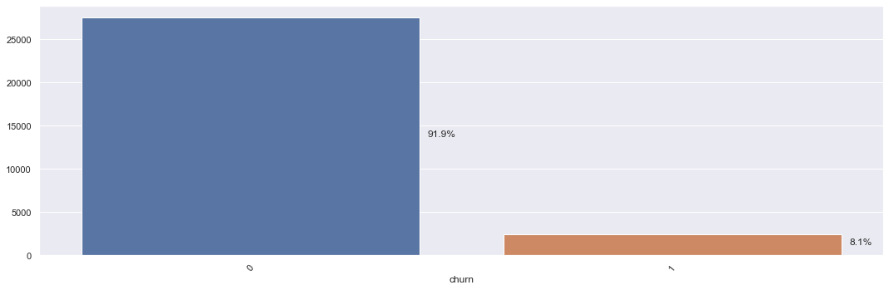


We can see that this data is highly imbalanced as the positive class (churn=1) is very less in number compared to negative class (churn=0). We will use class imbalance techniques like SMOTE to balance the data once we start with the model creation.


```python
for c in telecom_data.columns:
    print(c)
```

    arpu_6
    arpu_7
    arpu_8
    onnet_mou_6
    onnet_mou_7
    onnet_mou_8
    offnet_mou_6
    offnet_mou_7
    offnet_mou_8
    roam_ic_mou_6
    roam_ic_mou_7
    roam_ic_mou_8
    roam_og_mou_6
    roam_og_mou_7
    roam_og_mou_8
    loc_og_t2t_mou_6
    loc_og_t2t_mou_7
    loc_og_t2t_mou_8
    loc_og_t2m_mou_6
    loc_og_t2m_mou_7
    loc_og_t2m_mou_8
    loc_og_t2f_mou_6
    loc_og_t2f_mou_7
    loc_og_t2f_mou_8
    loc_og_t2c_mou_6
    loc_og_t2c_mou_7
    loc_og_t2c_mou_8
    loc_og_mou_6
    loc_og_mou_7
    loc_og_mou_8
    std_og_t2t_mou_6
    std_og_t2t_mou_7
    std_og_t2t_mou_8
    std_og_t2m_mou_6
    std_og_t2m_mou_7
    std_og_t2m_mou_8
    std_og_t2f_mou_6
    std_og_t2f_mou_7
    std_og_t2f_mou_8
    std_og_mou_6
    std_og_mou_7
    std_og_mou_8
    isd_og_mou_6
    isd_og_mou_7
    isd_og_mou_8
    spl_og_mou_6
    spl_og_mou_7
    spl_og_mou_8
    og_others_6
    og_others_7
    og_others_8
    total_og_mou_6
    total_og_mou_7
    total_og_mou_8
    loc_ic_t2t_mou_6
    loc_ic_t2t_mou_7
    loc_ic_t2t_mou_8
    loc_ic_t2m_mou_6
    loc_ic_t2m_mou_7
    loc_ic_t2m_mou_8
    loc_ic_t2f_mou_6
    loc_ic_t2f_mou_7
    loc_ic_t2f_mou_8
    loc_ic_mou_6
    loc_ic_mou_7
    loc_ic_mou_8
    std_ic_t2t_mou_6
    std_ic_t2t_mou_7
    std_ic_t2t_mou_8
    std_ic_t2m_mou_6
    std_ic_t2m_mou_7
    std_ic_t2m_mou_8
    std_ic_t2f_mou_6
    std_ic_t2f_mou_7
    std_ic_t2f_mou_8
    std_ic_mou_6
    std_ic_mou_7
    std_ic_mou_8
    total_ic_mou_6
    total_ic_mou_7
    total_ic_mou_8
    spl_ic_mou_6
    spl_ic_mou_7
    spl_ic_mou_8
    isd_ic_mou_6
    isd_ic_mou_7
    isd_ic_mou_8
    ic_others_6
    ic_others_7
    ic_others_8
    last_day_rch_amt_6
    last_day_rch_amt_7
    last_day_rch_amt_8
    night_pck_user_6
    night_pck_user_7
    night_pck_user_8
    monthly_2g_6
    monthly_2g_7
    monthly_2g_8
    monthly_3g_6
    monthly_3g_7
    monthly_3g_8
    fb_user_6
    fb_user_7
    fb_user_8
    aon
    aug_vbc_3g
    jul_vbc_3g
    jun_vbc_3g
    average_recharge_amount
    churn
    total_amount_spent_8
    total_data_mb_6
    total_data_mb_7
    total_data_mb_8
    total_recharge_count_6
    total_recharge_count_7
    total_recharge_count_8
    total_arpu_data_6
    total_arpu_data_7
    total_arpu_data_8
    total_sachet_data_6
    total_sachet_data_7
    total_sachet_data_8


```python
univariate_analysis('aon')
```

    count   29953.0000
    mean     1209.2806
    std       957.4494
    min       180.0000
    25%       460.0000
    50%       846.0000
    75%      1756.0000
    max      4321.0000
    Name: aon, dtype: float64


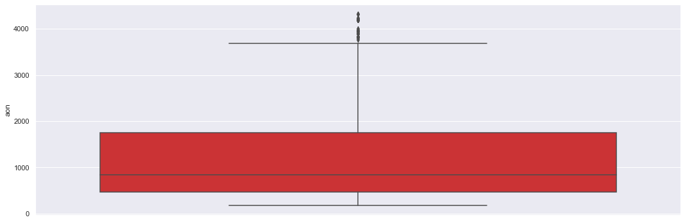


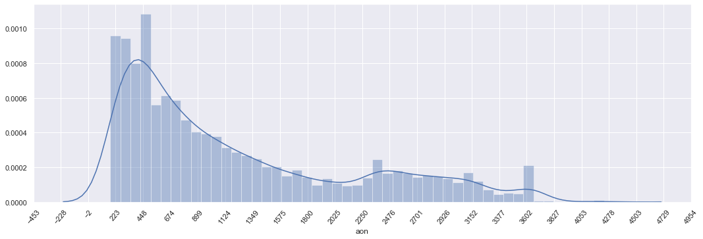


We can see that the all the customers are with the company for than a half year.
We can create a column which will have the age on the network in years.


```python
telecom_data['aon_year'] = telecom_data['aon'].apply(lambda x: x//365)
telecom_data['aon_year'] = telecom_data['aon_year'].astype('category')
telecom_data = telecom_data.drop('aon',axis=1)
```


```python
bivariate_analysis('aon_year',
                   'churn',
                   title="Comparing age on network with churned",
                   xlabel='Age on network',
                   ylabel='Count')
```


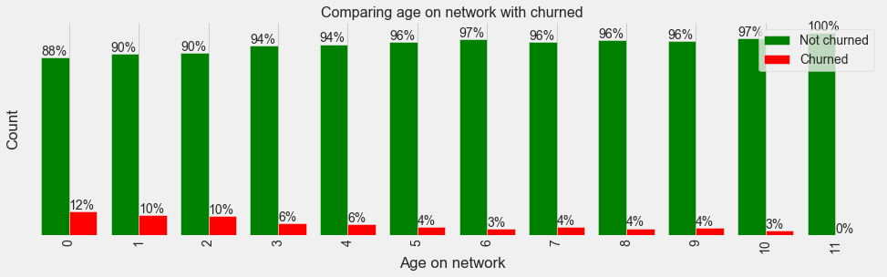


We can see as the age on network increases the churn rate decreases. Most churn happens in the starting 2 years.

Now, we will various features averaged for each (Jun, July and Aug)


```python
def month_wise_analysis(columns, title, xlabel, ylabel, df=telecom_data):
    plot1 = plt.figure(1)
    sns.boxplot(x="variable", y="value", data=pd.melt(df[columns]))
    plt.show()
    means = df.groupby('churn')[columns].mean()
    means.rename(columns={means.columns[0]: "Jun", means.columns[1]: "Jul", means.columns[2]: "Aug"}, inplace=True)
    print(means)
    plot2 = plt.figure(1)
    plt.plot(means.T)
    plt.title(title)
    plt.xlabel(xlabel)
    plt.ylabel(ylabel)
    plt.legend(['Non-Churn', 'Churn'])
    plt.show()
```


```python
month_wise_analysis(['arpu_6', 'arpu_7', 'arpu_8'],
                    'Month wise Arpu analysis for churn', 'Month', 'Arpu')
```


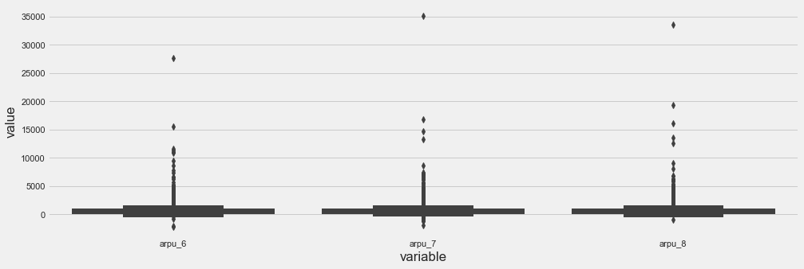


               Jun      Jul      Aug
    churn                           
    0     549.5470 562.9300 532.8697
    1     663.7094 541.1461 237.6555


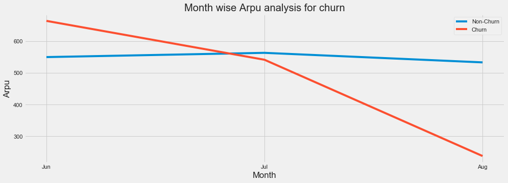


We can see that the average revenue decreases significantly for the churned customer from Jun to Aug. In case of non-churned customers it is almost constant. We can see there are outliers. We will treat them in outliers treatment section.


```python
month_wise_analysis(['onnet_mou_6', 'onnet_mou_7', 'onnet_mou_8'],
                    'Month wise with in the same network for churn', 'Month', 'Onnet MOU')
```


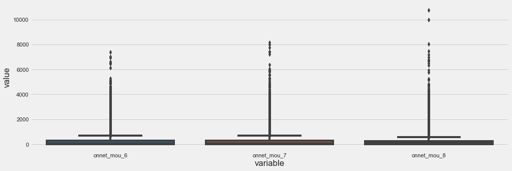


               Jun      Jul      Aug
    churn                           
    0     251.3741 265.8597 245.0309
    1     368.6594 292.8466 113.4780


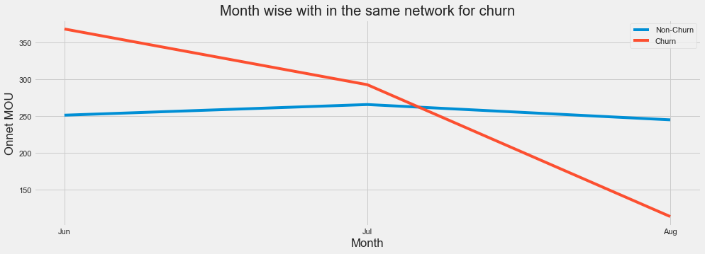


We can see that the average revenue decreases significantly for the churned customer from Jun to Aug. In case of non-churned customers it is almost constant. We can see there are outliers. We will treat them in outliers treatment section.


```python
month_wise_analysis(['roam_ic_mou_6', 'roam_ic_mou_7', 'roam_ic_mou_8'],
                    'Month wise roaming incoming for churn', 'Month', 'Roaming Incomin MOU')
```


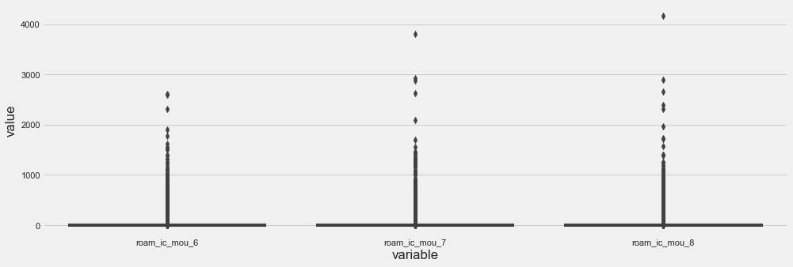


              Jun     Jul     Aug
    churn                        
    0     14.9823 11.1138 11.2065
    1     29.0377 29.9788 27.2821


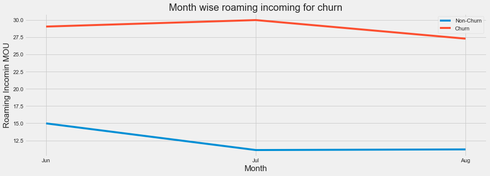


We can see that the customers who churned had high roaming incoming usage. Hence, a better pack or deal on incoming roaming can be given to stop the churn.


```python
month_wise_analysis(['roam_og_mou_6', 'roam_og_mou_7', 'roam_og_mou_8'],
                    'Month wise roaming incoming for churn', 'Month', 'Roaming Incomin MOU')
```


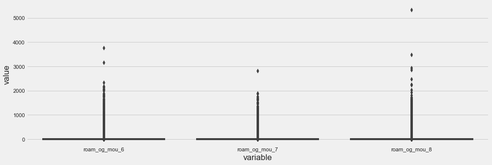


              Jun     Jul     Aug
    churn                        
    0     24.3533 17.5008 17.7816
    1     51.9642 50.1792 43.7300


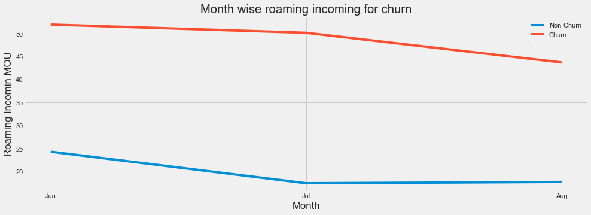


We can see that the customers who churned had high roaming outgoing usage. Hence, a better pack or deal on outgoing roaming can be given to stop the churn.


```python
month_wise_analysis(['loc_og_mou_6', 'loc_og_mou_7', 'loc_og_mou_8'],
                    'Month wise local outgoing for churn', 'Month', 'Local outgoing MOU')
```


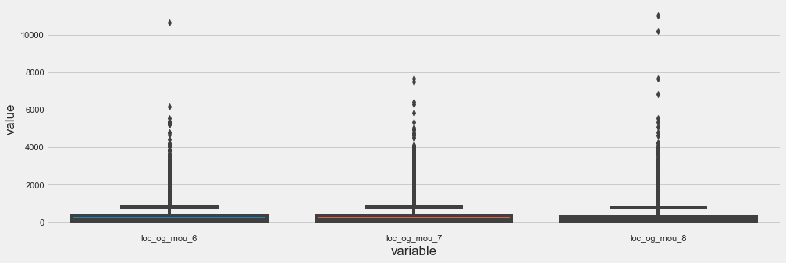


               Jun      Jul      Aug
    churn                           
    0     261.1244 265.7696 252.3358
    1     176.3724 136.6957  49.5382


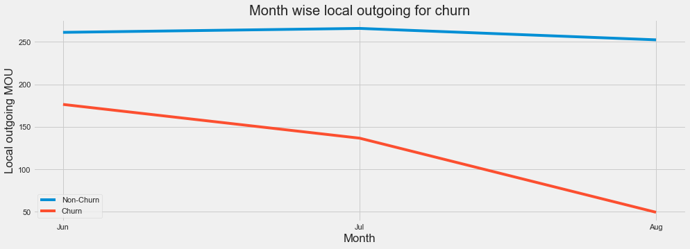


We can see the local outgoing usage for the churn customer is decreasing as the time increases. The company can provide pack etc to encourage more outgoing calls.


```python
month_wise_analysis(['std_og_mou_6', 'std_og_mou_7', 'std_og_mou_8'],
                    'Month wise STD outgoing for churn', 'Month', 'STD outgoing MOU')
```


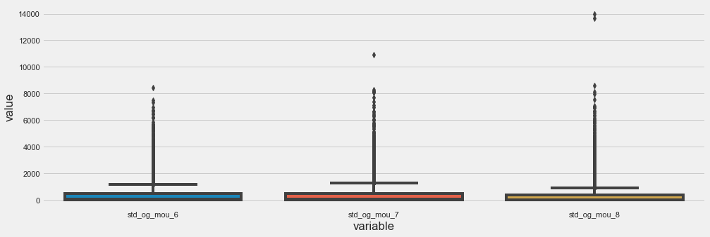


               Jun      Jul      Aug
    churn                           
    0     324.5269 353.8073 320.8792
    1     603.0072 481.4109 156.1696


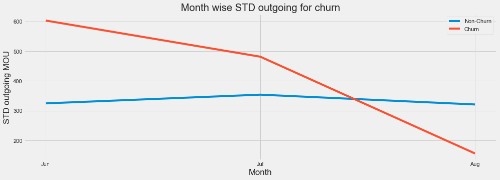


We can see the std outgoing usage for the churn customer is decreasing as the time increases. The company can provide pack etc to encourage more std outgoing calls.


```python
month_wise_analysis(['isd_og_mou_6', 'isd_og_mou_7', 'isd_og_mou_8'],
                    'Month wise ISD outgoing for churn', 'Month', 'ISD outgoing MOU')
```


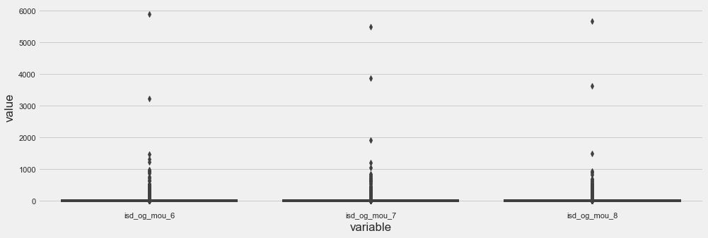


             Jun    Jul    Aug
    churn                     
    0     1.9827 2.0180 2.0148
    1     4.3501 3.1390 1.2425


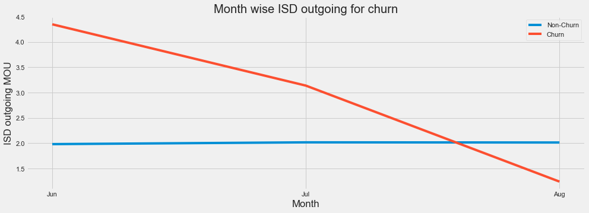


We can see the ISD outgoing usage for the churn customer is decreasing as the time increases. The company can provide pack etc to encourage more ISD outgoing calls.


```python
month_wise_analysis(['total_og_mou_6', 'total_og_mou_7', 'total_og_mou_8'],
                    'Month wise total outgoing for churn', 'Month', 'Total outgoing MOU')
```


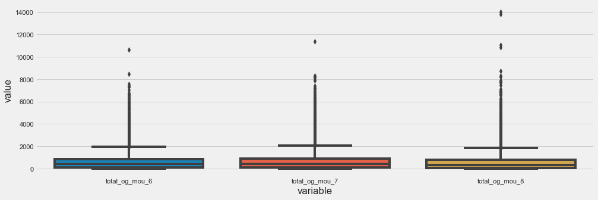


               Jun      Jul      Aug
    churn                           
    0     593.9961 628.7205 582.1774
    1     791.7370 628.7653 209.7945


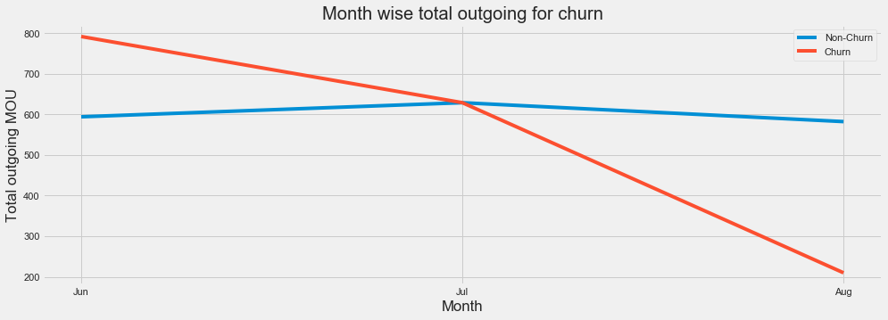


We can see that the total outgoing mou decreases significantly for the churned customer from Jun to Aug. In case of non-churned customers it is almost constant. We can see there are outliers. We will treat them in outliers treatment section.


```python
month_wise_analysis(['jun_vbc_3g', 'jul_vbc_3g', 'aug_vbc_3g'],
                    'Month wise volume based for churn', 'Month', 'Volume 3G')
```


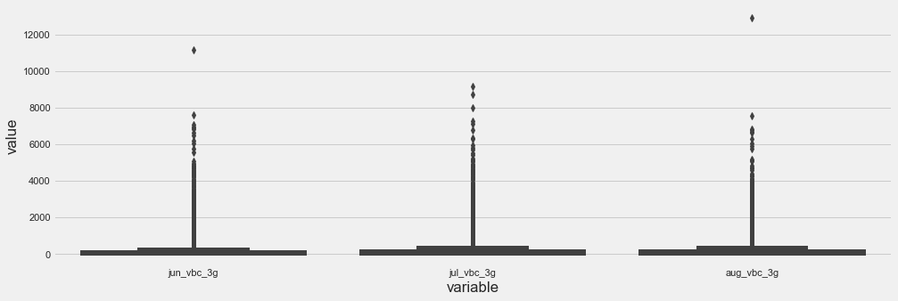


               Jun      Jul      Aug
    churn                           
    0     162.5573 186.3705 180.6226
    1     115.4618  96.3407  40.9409


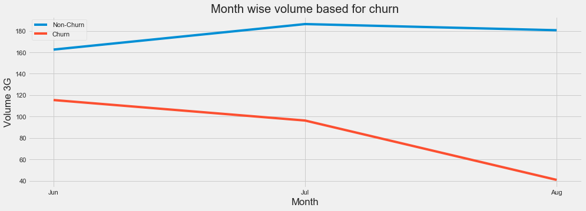


We can see that the 3g volume mou decreases significantly for the churned customer from Jun to Aug. In case of non-churned customers it is almost constant. We can see there are outliers. We will treat them in outliers treatment section.


```python
univariate_analysis('average_recharge_amount')
```

    count   29953.0000
    mean     1153.7017
    std      1359.5336
    min       478.5000
    25%       604.0000
    50%       800.5000
    75%      1209.0000
    max     61236.0000
    Name: average_recharge_amount, dtype: float64


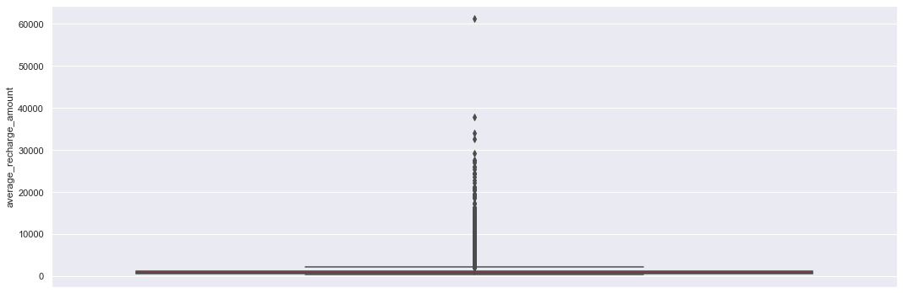


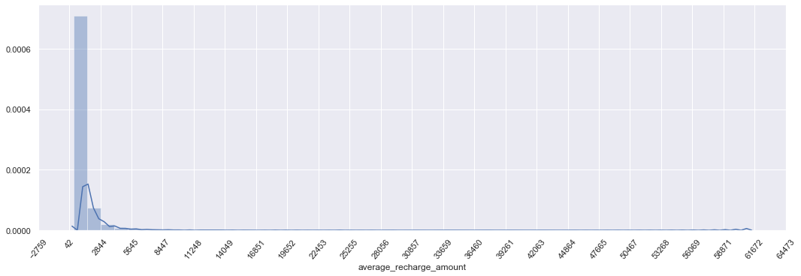


We can see that there are outliers here which makes sense as there will be some customers who pay huge money for recharge.


```python
month_wise_analysis(['total_data_mb_6', 'total_data_mb_7', 'total_data_mb_8'],
                    'Month Data in MB for churn', 'Month', 'Data MB')
```


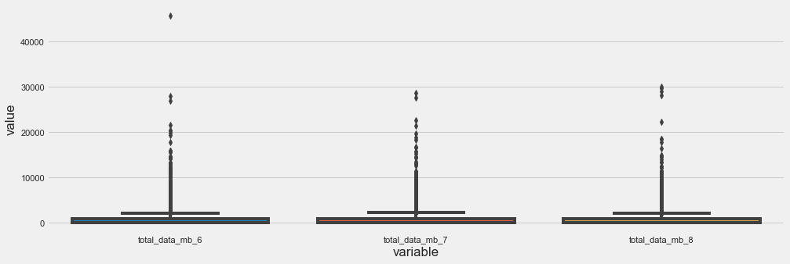


               Jun      Jul      Aug
    churn                           
    0     605.7925 640.2835 601.5430
    1     506.2850 400.0708 134.1448


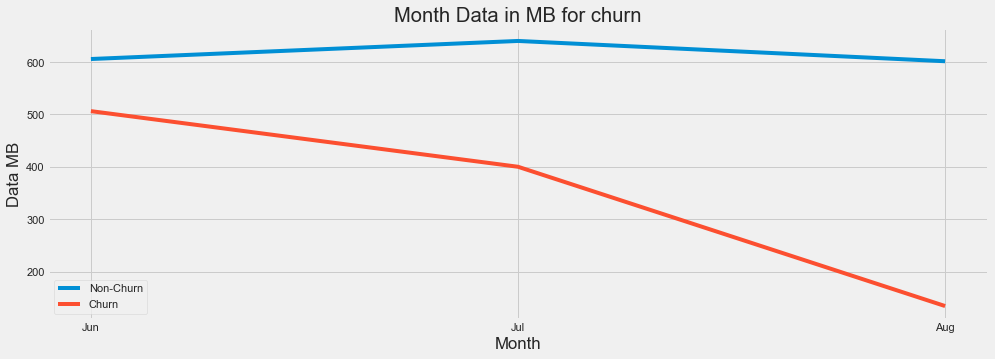


We can see that the total outgoing mou decreases significantly for the churned customer from Jun to Aug. In case of non-churned customers it is almost constant. We can see there are outliers. We will treat them in outliers treatment section.


```python
month_wise_analysis(['total_arpu_data_6', 'total_arpu_data_7', 'total_arpu_data_8'],
                    'Arpu data for churn', 'Month', 'ARPU Data MB')
```


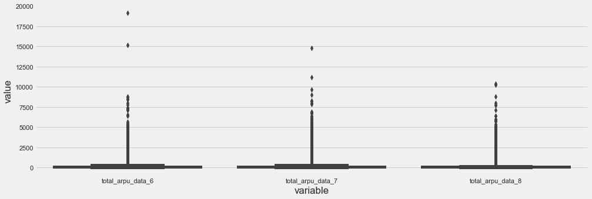


               Jun      Jul      Aug
    churn                           
    0     197.9403 206.9873 195.6237
    1     195.2407 148.4653  53.9988


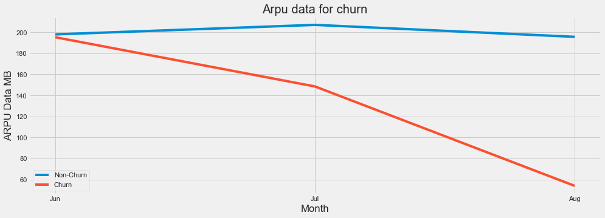


We can see that the data arpu decreases significantly for the churned customer from Jun to Aug. In case of non-churned customers it is almost constant. We can see there are outliers. We will treat them in outliers treatment section.

## Outliers treatment 

We saw that there are many features which have outliers. However, we can remove all of them as it may impact the model accuracy. We will remove the rows which have more than 99 percentile for following features:

1. arpu
2. average_recharge_amount
3. total_data_mb
4. total_og_mou
5. total_arpu_data


```python
outlier_features = ['arpu_6','arpu_7','average_recharge_amount','total_data_mb_6',
                    'total_data_mb_7','total_og_mou_6','total_og_mou_7','total_arpu_data_6',
                    'total_arpu_data_7']

for column in outlier_features:
    upper = telecom_data[column].quantile(.99)
    telecom_data = telecom_data[telecom_data[column] < upper]
```


```python
telecom_data.shape
```


    (27359, 124)


```python
numerical_columns = telecom_data.select_dtypes(
    include=['int64', 'float64']).columns

columns_to_encode = telecom_data.select_dtypes(
    include=['category', 'object']).columns.tolist()
columns_to_encode.remove('churn')

```


```python
# Creating the dummy variables and deleting the unknown class (-1) which we substituted for `NAN`
for c in columns_to_encode:
    dummy_pd = pd.get_dummies(telecom_data[c],
                              prefix=c)
    if((c + "-1") in dummy_pd.columns):
        dummy_pd = dummy_pd.drop((c+"-1"), axis=1)
    else:
        dummy_pd = dummy_pd.drop(dummy_pd.columns[0], axis=1)

    telecom_data = pd.concat([telecom_data, dummy_pd], axis=1)
```


```python
# Deleting the original columns
telecom_data = telecom_data.drop(columns_to_encode, axis=1)
```


```python
def heat_map(data):
    corr = data.corr()
    sns.set(rc={'figure.figsize': (20, 20)})
    plt.tight_layout()
    ax = sns.heatmap(corr, xticklabels=corr.columns, yticklabels=corr.columns, cmap='RdBu',annot=True)
    bottom, top = ax.get_ylim()
    ax.set_ylim(bottom + 0.5, top - 0.5)
```


```python
heat_map(telecom_data[numerical_columns])
```


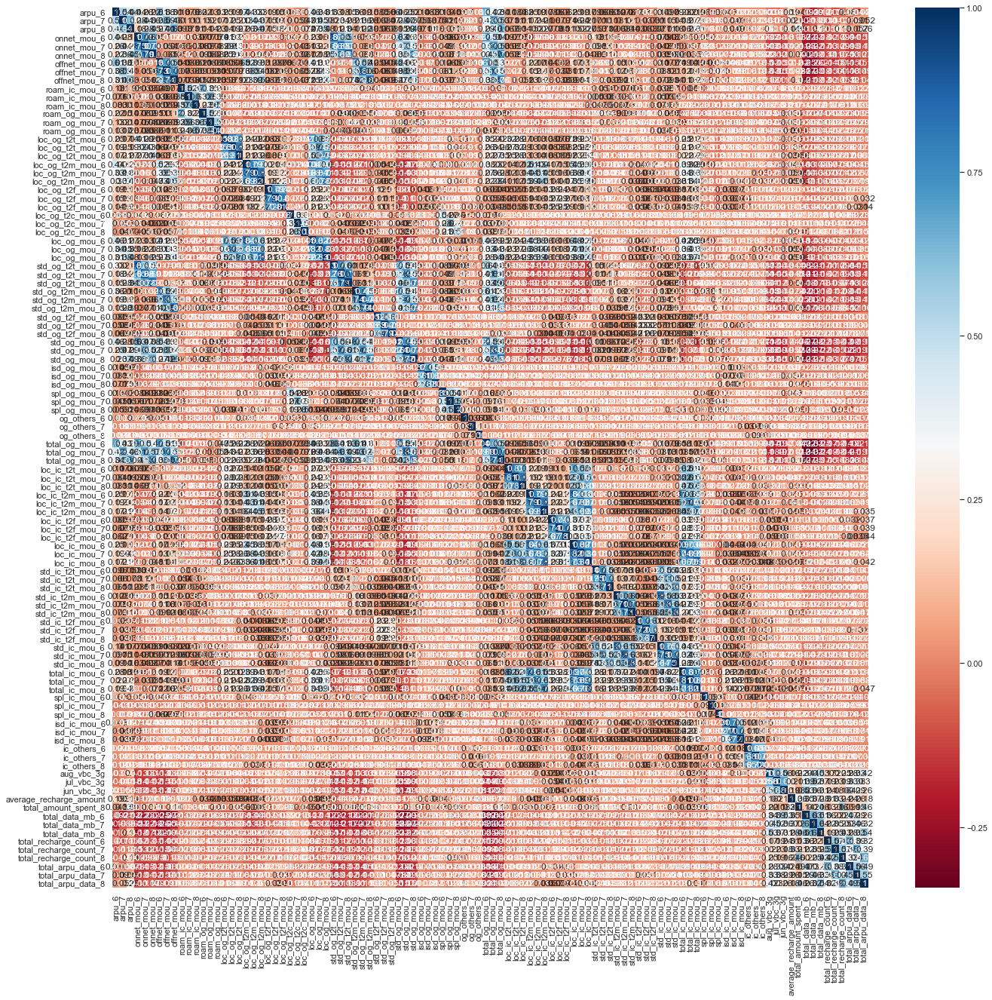


```python
# Reference https://chrisalbon.com/machine_learning/feature_selection/drop_highly_correlated_features/

# List of correlated columns

corr_matrix = telecom_data[numerical_columns].corr().abs()

# Select upper triangle of correlation matrix
upper = corr_matrix.where(np.triu(np.ones(corr_matrix.shape), k=1).astype(np.bool))

# Find index of feature columns with correlation greater than 0.80
to_drop = [column for column in upper.columns if any(upper[column] > 0.80)]
print('found ',len(to_drop),' highly correlated features.')
print(to_drop)

```

    found  26  highly correlated features.
    ['loc_og_t2t_mou_7', 'loc_og_t2t_mou_8', 'loc_og_t2m_mou_8', 'loc_og_mou_6', 'loc_og_mou_7', 'loc_og_mou_8', 'std_og_t2t_mou_6', 'std_og_t2t_mou_7', 'std_og_t2t_mou_8', 'std_og_t2m_mou_7', 'std_og_t2m_mou_8', 'total_og_mou_6', 'total_og_mou_7', 'total_og_mou_8', 'loc_ic_t2t_mou_7', 'loc_ic_t2t_mou_8', 'loc_ic_t2m_mou_8', 'loc_ic_mou_6', 'loc_ic_mou_7', 'loc_ic_mou_8', 'std_ic_mou_6', 'std_ic_mou_7', 'std_ic_mou_8', 'total_ic_mou_6', 'total_ic_mou_7', 'total_ic_mou_8']


We found 26 features which are around 80% correlated. We will not be deleting them as we will use PCA for dimension reduction.


```python
## Saving the cleaned data 
from pathlib import Path
def save_clean_data():
    clean_file = Path("clean_data.csv")
    if clean_file.is_file():
        telecom_data = pd.read_csv('clean_data.csv')
    else:
        telecom_data.to_csv('clean_data.csv',header=True)
```

# Class imbalance


```python
univariate_analysis('churn', is_categorical=True)
```


We can see that churn class is highly imbalanced. We will `SMOTE` to over sample the less frequent class.


```python
pip install imbalanced-learn
```

    Requirement already satisfied: imbalanced-learn in /Users/akumar/opt/anaconda3/lib/python3.7/site-packages (0.6.2)
    Requirement already satisfied: joblib>=0.11 in /Users/akumar/opt/anaconda3/lib/python3.7/site-packages (from imbalanced-learn) (0.13.2)
    Requirement already satisfied: numpy>=1.11 in /Users/akumar/opt/anaconda3/lib/python3.7/site-packages (from imbalanced-learn) (1.17.2)
    Requirement already satisfied: scipy>=0.17 in /Users/akumar/opt/anaconda3/lib/python3.7/site-packages (from imbalanced-learn) (1.3.1)
    Requirement already satisfied: scikit-learn>=0.22 in /Users/akumar/opt/anaconda3/lib/python3.7/site-packages (from imbalanced-learn) (0.23.0)
    Requirement already satisfied: threadpoolctl>=2.0.0 in /Users/akumar/opt/anaconda3/lib/python3.7/site-packages (from scikit-learn>=0.22->imbalanced-learn) (2.0.0)
    Note: you may need to restart the kernel to use updated packages.


```python
random_seed = 101
```


```python
y = telecom_data.pop('churn')
X = telecom_data
```


```python
from sklearn.model_selection import train_test_split

X_train, X_test, y_train, y_test = train_test_split(X,
                                                    y,
                                                    train_size=0.7,
                                                    test_size=0.3,
                                                    random_state=random_seed)
```


```python
# We will scale the data as PCA is senstive to the scale.
from sklearn.preprocessing import StandardScaler
scaler = StandardScaler()

X_train = scaler.fit_transform(X_train)
X_test = scaler.transform(X_test)
```


```python
from imblearn.over_sampling import SMOTE
smote = SMOTE()

X_train_smote, y_train_smote = smote.fit_sample(X_train,y_train)

from collections import Counter
print("Before SMOTE:" , Counter(y_train))
print("After SMOTE:" , Counter(y_train_smote))
```

    Before SMOTE: Counter({0: 17676, 1: 1475})
    After SMOTE: Counter({0: 17676, 1: 17676})


## PCA


```python
from sklearn.decomposition import PCA
```


```python
pca = PCA(random_state=random_seed)
```


```python
pca.fit(X_train_smote)
```


    PCA(random_state=101)


```python
pca.explained_variance_ratio_
```


    array([1.12554136e-01, 8.77989598e-02, 4.87206218e-02, 4.32857160e-02,
           3.98168877e-02, 3.53703265e-02, 2.90286446e-02, 2.67471406e-02,
           2.08638904e-02, 1.97186128e-02, 1.87554682e-02, 1.76334888e-02,
           1.62879469e-02, 1.57739955e-02, 1.55231879e-02, 1.50715021e-02,
           1.41303411e-02, 1.33698598e-02, 1.31875572e-02, 1.29102263e-02,
           1.16511329e-02, 1.14970489e-02, 1.13033048e-02, 1.07768413e-02,
           9.90896029e-03, 9.66372306e-03, 8.99637713e-03, 8.82192419e-03,
           8.60317188e-03, 8.38623792e-03, 8.30493860e-03, 7.97901626e-03,
           7.63670409e-03, 7.54878920e-03, 7.32948698e-03, 7.16233426e-03,
           6.94616029e-03, 6.63808868e-03, 6.53675539e-03, 6.50332737e-03,
           6.41388171e-03, 6.36517067e-03, 6.28463285e-03, 6.19517459e-03,
           6.01409492e-03, 5.91455727e-03, 5.90166567e-03, 5.72933553e-03,
           5.63339606e-03, 5.56534614e-03, 5.39577987e-03, 5.30195713e-03,
           5.08937796e-03, 4.96289495e-03, 4.88974288e-03, 4.78203678e-03,
           4.71354470e-03, 4.56709779e-03, 4.47393492e-03, 4.34945787e-03,
           3.99561999e-03, 3.94900987e-03, 3.90734017e-03, 3.80532820e-03,
           3.78534640e-03, 3.69755381e-03, 3.53549364e-03, 3.48310442e-03,
           3.29679440e-03, 3.22376648e-03, 3.11819879e-03, 3.05924702e-03,
           2.93338497e-03, 2.86143092e-03, 2.63336076e-03, 2.48322176e-03,
           2.42018279e-03, 2.32918317e-03, 2.25187545e-03, 2.21376307e-03,
           2.13700353e-03, 2.08896982e-03, 1.96354363e-03, 1.93029703e-03,
           1.92570271e-03, 1.84284428e-03, 1.75299365e-03, 1.70474918e-03,
           1.62850325e-03, 1.58530230e-03, 1.47622856e-03, 1.39298200e-03,
           1.36360053e-03, 1.30975479e-03, 1.28515464e-03, 1.24975626e-03,
           1.23293359e-03, 1.20342202e-03, 1.09638097e-03, 1.08584815e-03,
           1.06255088e-03, 9.42463700e-04, 9.17085473e-04, 8.68171910e-04,
           8.36475606e-04, 7.20876200e-04, 6.78442139e-04, 5.93593201e-04,
           5.43252708e-04, 4.44720502e-04, 4.03557455e-04, 3.24333438e-04,
           9.10668399e-05, 2.93856973e-05, 1.75994358e-05, 8.27894771e-07,
           3.02232381e-07, 2.03706827e-07, 8.55318721e-12, 4.07954731e-12,
           3.42951851e-12, 3.29034116e-12, 2.01503554e-12, 1.69045812e-12,
           1.65674053e-12, 1.19556758e-12, 1.09298138e-12, 1.05504236e-12,
           8.02584385e-13, 7.58709820e-13, 6.93297200e-13, 4.88813136e-13,
           4.03473800e-13, 2.99288554e-13, 2.25567603e-13, 1.76395627e-13,
           1.56089867e-29, 2.21973894e-32, 8.12205915e-34])


```python
# Making a scree plot for the explained variance
var_cumu = np.cumsum(pca.explained_variance_ratio_)
fig = plt.figure(figsize=[12,8])
plt.vlines(x=75, ymax=1, ymin=0, colors="r", linestyles="--")
plt.hlines(y=0.95, xmax=150, xmin=0, colors="g", linestyles="--")
plt.plot(var_cumu)
plt.ylabel("Cumulative variance explained")
plt.show()
```


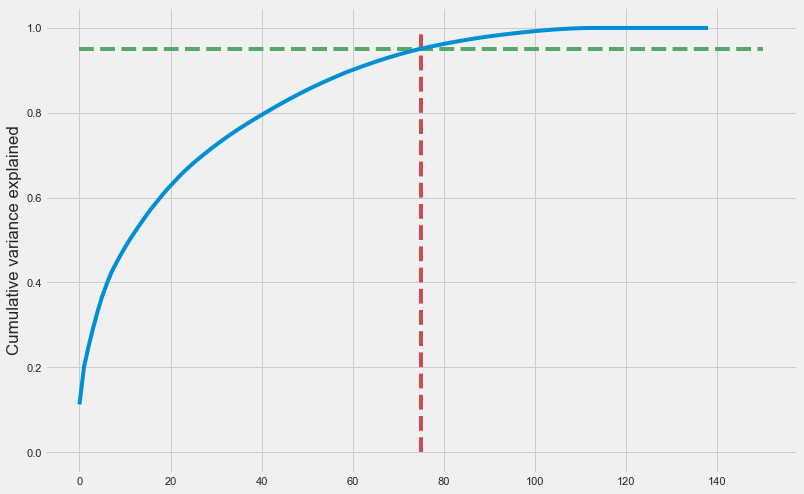


From the graph we can see that 95% variance of the data. From now onwards, we will consider 75 components for the analysis


```python
from sklearn.decomposition import IncrementalPCA
pca_final = IncrementalPCA(n_components=75)
X_train_pca = pca_final.fit_transform(X_train_smote)
X_train_pca.shape
```


    (35352, 75)


```python
# Getting the minimum and maximum value from the correlation matrix.
# Reference https://stackoverflow.com/questions/29394377/minimum-of-numpy-array-ignoring-diagonal

corr_matrix = np.corrcoef(X_train_pca.transpose())
mask = np.ones(corr_matrix.shape, dtype=bool)
np.fill_diagonal(mask, 0)
max_value = corr_matrix[mask].max()
min_value = corr_matrix[mask].min()

print('Max: ', max_value, ' , Min: ', min_value )
```

    Max:  0.021094020167481152  , Min:  -0.026465719581756905


We can say that after PCA, there is no multi collinearity in the data set.

Applying the transformation on the test set


```python
X_test_pca = pca_final.transform(X_test)
X_test_pca.shape
```


    (8208, 75)


# Model creation

## With PCA

We will be creating following model:
1. DummyClassifier (Base Model)
2. Logistic Regression
3. Decision Tree
4. Random Forest
5. Boosting models


```python
from sklearn.dummy import DummyClassifier
from sklearn.linear_model import LogisticRegression
from sklearn.tree import DecisionTreeClassifier
from sklearn.ensemble import RandomForestClassifier, AdaBoostClassifier, GradientBoostingClassifier
from sklearn.metrics import accuracy_score
from sklearn.metrics import precision_score
from sklearn.metrics import recall_score
from sklearn.metrics import f1_score
from sklearn.metrics import roc_auc_score
from sklearn.metrics import roc_curve
from sklearn.model_selection import GridSearchCV
from xgboost import XGBClassifier
from time import time
```


```python
def draw_roc( actual, probs ):
    fpr, tpr, thresholds = roc_curve( actual, probs,
                                              drop_intermediate = False )
    auc_score = roc_auc_score( actual, probs )
    plt.figure(figsize=(6, 6))
    plt.plot( fpr, tpr, label='ROC curve (area = %0.2f)' % auc_score )
    plt.plot([0, 1], [0, 1], 'k--')
    plt.xlim([0.0, 1.0])
    plt.ylim([0.0, 1.05])
    plt.xlabel('False Positive Rate or [1 - True Negative Rate]')
    plt.ylabel('True Positive Rate')
    plt.title('Receiver operating characteristic example')
    plt.legend(loc="lower right")
    plt.show()

    return fpr, tpr, thresholds
```


```python
def train_model(classifier_name, classifier, X_train_model, y_train_model,
                X_test_model, y_test_model):
    start = time()
    classifier.fit(X_train_model, y_train_model)
    df_train = predict_and_get_metrics('train', classifier, X_train_model,
                                       y_train_model)
    train_time = time() - start
    start = time()
    df_test = predict_and_get_metrics('test', classifier, X_test_model,
                                      y_test_model)
    df = pd.concat([df_train, df_test], axis=1)
    df.insert(0, "name", [classifier_name], True)
    score_time = time()-start
    print("ModelName: {:<15} | time (training/test) = {:,.3f}s/{:,.3f}s".format(classifier_name, train_time, score_time))
    return df
```


```python
def predict_and_get_metrics(score_type, classifier, X_model, y_model):
    y_pred = classifier.predict(X_model)
    y_pred_prob = classifier.predict_proba(X_model)[:, 1]
    if(score_type=='test'):
        draw_roc(y_model, y_pred_prob)
    accuracy = accuracy_score(y_model, y_pred)
    precision = precision_score(y_model, y_pred)
    recall = recall_score(y_model, y_pred)
    f1 = f1_score(y_model, y_pred)
    auc = roc_auc_score(y_model, y_pred_prob)

    metrics_dict = {}
    metrics_dict[score_type + '_accuracy'] = accuracy
    metrics_dict[score_type + '_precision'] = precision
    metrics_dict[score_type + '_recall'] = recall
    metrics_dict[score_type + '_f1'] = f1
    metrics_dict[score_type + '_auc'] = auc
    records = []
    records.append(metrics_dict)
    return pd.DataFrame.from_records(records)
```


```python
def hyperparameter_tuning(classifier,
                          params_grid,
                          n_folds=5,
                          scoring='recall',
                          X_train=X_train_pca):
    grid_search = GridSearchCV(estimator=classifier,
                               param_grid=params_grid,
                               cv=n_folds,
                               verbose=1,
                               n_jobs=-1,
                               scoring=scoring)
    grid_search.fit(X_train, y_train_smote)
    print(grid_search.best_estimator_)
```

## Baseline Model


```python
base_line_model = DummyClassifier(random_state=random_seed)

model_metrics = train_model('base_line', base_line_model, X_train_pca, y_train_smote,
            X_test_pca, y_test)
model_metrics
```


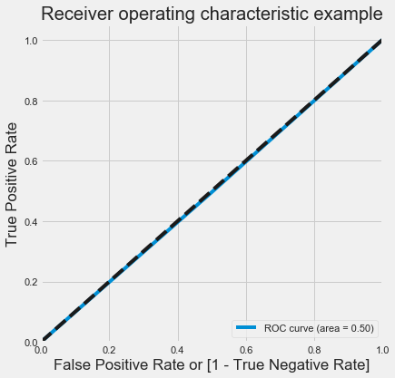


<div>
<style scoped>
    .dataframe tbody tr th:only-of-type {
        vertical-align: middle;
    }

    .dataframe tbody tr th {
        vertical-align: top;
    }

    .dataframe thead th {
        text-align: right;
    }
</style>
<table border="1" class="dataframe">
  <thead>
    <tr style="text-align: right;">
      <th></th>
      <th>name</th>
      <th>train_accuracy</th>
      <th>train_precision</th>
      <th>train_recall</th>
      <th>train_f1</th>
      <th>train_auc</th>
      <th>test_accuracy</th>
      <th>test_precision</th>
      <th>test_recall</th>
      <th>test_f1</th>
      <th>test_auc</th>
    </tr>
  </thead>
  <tbody>
    <tr>
      <td>0</td>
      <td>base_line</td>
      <td>0.5006</td>
      <td>0.5006</td>
      <td>0.5004</td>
      <td>0.5005</td>
      <td>0.5006</td>
      <td>0.5011</td>
      <td>0.0785</td>
      <td>0.4938</td>
      <td>0.1355</td>
      <td>0.4978</td>
    </tr>
  </tbody>
</table>
</div>


## Logistic Regression


```python
logistic_model = LogisticRegression(random_state=random_seed)

df = train_model('logistic_regression', logistic, X_train_pca, y_train_smote,
            X_test_pca, y_test)
model_metrics = pd.concat([model_metrics,df],axis=0)
df
```


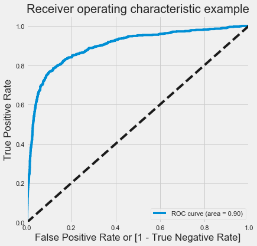


    ModelName: logistic_regression | time (training/test) = 0.302s/0.243s


<div>
<style scoped>
    .dataframe tbody tr th:only-of-type {
        vertical-align: middle;
    }

    .dataframe tbody tr th {
        vertical-align: top;
    }

    .dataframe thead th {
        text-align: right;
    }
</style>
<table border="1" class="dataframe">
  <thead>
    <tr style="text-align: right;">
      <th></th>
      <th>name</th>
      <th>train_accuracy</th>
      <th>train_precision</th>
      <th>train_recall</th>
      <th>train_f1</th>
      <th>train_auc</th>
      <th>test_accuracy</th>
      <th>test_precision</th>
      <th>test_recall</th>
      <th>test_f1</th>
      <th>test_auc</th>
    </tr>
  </thead>
  <tbody>
    <tr>
      <td>0</td>
      <td>logistic_regression</td>
      <td>0.8477</td>
      <td>0.8349</td>
      <td>0.8668</td>
      <td>0.8506</td>
      <td>0.9157</td>
      <td>0.8235</td>
      <td>0.2874</td>
      <td>0.8308</td>
      <td>0.4270</td>
      <td>0.8967</td>
    </tr>
  </tbody>
</table>
</div>


## Decision Tree


```python
decision_tree_model = DecisionTreeClassifier(random_state=random_seed,
                                             max_depth=7,
                                             min_samples_leaf=1,
                                             min_samples_split=2)

df = train_model('decision_tree_default', decision_tree_model, X_train_pca,
                 y_train_smote, X_test_pca, y_test)
model_metrics = pd.concat([model_metrics, df], axis=0)
df
```


<div>
<style scoped>
    .dataframe tbody tr th:only-of-type {
        vertical-align: middle;
    }

    .dataframe tbody tr th {
        vertical-align: top;
    }

    .dataframe thead th {
        text-align: right;
    }
</style>
<table border="1" class="dataframe">
  <thead>
    <tr style="text-align: right;">
      <th></th>
      <th>name</th>
      <th>train_accuracy</th>
      <th>train_precision</th>
      <th>train_recall</th>
      <th>train_f1</th>
      <th>train_auc</th>
      <th>test_accuracy</th>
      <th>test_precision</th>
      <th>test_recall</th>
      <th>test_f1</th>
      <th>test_auc</th>
    </tr>
  </thead>
  <tbody>
    <tr>
      <td>0</td>
      <td>decision_tree_default</td>
      <td>0.8479</td>
      <td>0.8521</td>
      <td>0.8418</td>
      <td>0.8469</td>
      <td>0.9110</td>
      <td>0.8291</td>
      <td>0.2768</td>
      <td>0.7185</td>
      <td>0.3997</td>
      <td>0.8350</td>
    </tr>
  </tbody>
</table>
</div>


### Hyperparameter tuning


```python
param_grid = {
    'max_depth': range(5, 15, 5),
    'min_samples_leaf': range(50, 150, 50),
    'min_samples_split': range(50, 150, 50),
    'criterion': ["entropy", "gini"]
}
hyperparameter_tuning(DecisionTreeClassifier(), param_grid)
```

    Fitting 5 folds for each of 16 candidates, totalling 80 fits


    [Parallel(n_jobs=-1)]: Using backend LokyBackend with 12 concurrent workers.
    [Parallel(n_jobs=-1)]: Done  26 tasks      | elapsed:    8.8s
    [Parallel(n_jobs=-1)]: Done  80 out of  80 | elapsed:   19.6s finished


    DecisionTreeClassifier(criterion='entropy', max_depth=10, min_samples_leaf=50,
                           min_samples_split=50)


```python
decision_tree_model = DecisionTreeClassifier(random_state=random_seed,
                                             criterion='entropy',
                                             max_depth=10,
                                             min_samples_leaf=50,
                                             min_samples_split=50)
df = train_model('decision_tree_tuned', decision_tree_model, X_train_pca,
                 y_train_smote, X_test_pca, y_test)
model_metrics = pd.concat([model_metrics, df], axis=0)
df
```


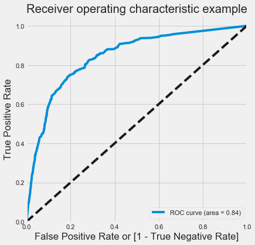


<div>
<style scoped>
    .dataframe tbody tr th:only-of-type {
        vertical-align: middle;
    }

    .dataframe tbody tr th {
        vertical-align: top;
    }

    .dataframe thead th {
        text-align: right;
    }
</style>
<table border="1" class="dataframe">
  <thead>
    <tr style="text-align: right;">
      <th></th>
      <th>name</th>
      <th>train_accuracy</th>
      <th>train_precision</th>
      <th>train_recall</th>
      <th>train_f1</th>
      <th>train_auc</th>
      <th>test_accuracy</th>
      <th>test_precision</th>
      <th>test_recall</th>
      <th>test_f1</th>
      <th>test_auc</th>
    </tr>
  </thead>
  <tbody>
    <tr>
      <td>0</td>
      <td>decision_tree_tuned</td>
      <td>0.8641</td>
      <td>0.8565</td>
      <td>0.8746</td>
      <td>0.8655</td>
      <td>0.9441</td>
      <td>0.8185</td>
      <td>0.2630</td>
      <td>0.7169</td>
      <td>0.3848</td>
      <td>0.8425</td>
    </tr>
  </tbody>
</table>
</div>


## Random Forest


```python
random_forest_model = RandomForestClassifier(random_state=random_seed,
                                             n_estimators=100,
                                             max_depth=7,
                                             min_samples_leaf=1,
                                             min_samples_split=2)

df = train_model('random_forest_default', random_forest_model, X_train_pca,
                 y_train_smote, X_test_pca, y_test)
model_metrics = pd.concat([model_metrics, df], axis=0)
df
```


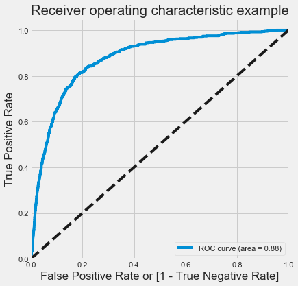


<div>
<style scoped>
    .dataframe tbody tr th:only-of-type {
        vertical-align: middle;
    }

    .dataframe tbody tr th {
        vertical-align: top;
    }

    .dataframe thead th {
        text-align: right;
    }
</style>
<table border="1" class="dataframe">
  <thead>
    <tr style="text-align: right;">
      <th></th>
      <th>name</th>
      <th>train_accuracy</th>
      <th>train_precision</th>
      <th>train_recall</th>
      <th>train_f1</th>
      <th>train_auc</th>
      <th>test_accuracy</th>
      <th>test_precision</th>
      <th>test_recall</th>
      <th>test_f1</th>
      <th>test_auc</th>
    </tr>
  </thead>
  <tbody>
    <tr>
      <td>0</td>
      <td>random_forest_default</td>
      <td>0.8766</td>
      <td>0.8756</td>
      <td>0.8779</td>
      <td>0.8768</td>
      <td>0.9436</td>
      <td>0.8492</td>
      <td>0.3113</td>
      <td>0.7462</td>
      <td>0.4393</td>
      <td>0.8771</td>
    </tr>
  </tbody>
</table>
</div>


### Hyperparameter tuning

This hyper parameter tuning for Random Forest takes around **4** minutes on a machine with 32 GB ram and 12 processor


```python
param_grid = {
    'max_depth': range(4, 8, 10),
    'min_samples_leaf': range(50, 150, 50),
    'min_samples_split': range(50, 150, 50),
    'n_estimators': [100, 150, 200],
    'max_features': [5, 10]
}
hyperparameter_tuning(RandomForestClassifier(), param_grid)
```

    Fitting 5 folds for each of 24 candidates, totalling 120 fits


    [Parallel(n_jobs=-1)]: Using backend LokyBackend with 12 concurrent workers.
    [Parallel(n_jobs=-1)]: Done  26 tasks      | elapsed:   33.4s
    [Parallel(n_jobs=-1)]: Done 120 out of 120 | elapsed:  3.3min finished


    RandomForestClassifier(max_depth=4, max_features=5, min_samples_leaf=100,
                           min_samples_split=100, n_estimators=200)


```python
random_forest_model = RandomForestClassifier(random_state=random_seed,
                                             n_estimators=200,
                                             max_depth=4,
                                             min_samples_leaf=100,
                                             min_samples_split=100)

df = train_model('random_forest_tuned', random_forest_model, X_train_pca,
                 y_train_smote, X_test_pca, y_test)
model_metrics = pd.concat([model_metrics, df], axis=0)
df
```


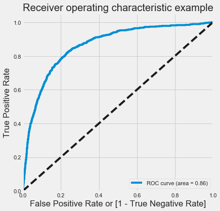


<div>
<style scoped>
    .dataframe tbody tr th:only-of-type {
        vertical-align: middle;
    }

    .dataframe tbody tr th {
        vertical-align: top;
    }

    .dataframe thead th {
        text-align: right;
    }
</style>
<table border="1" class="dataframe">
  <thead>
    <tr style="text-align: right;">
      <th></th>
      <th>name</th>
      <th>train_accuracy</th>
      <th>train_precision</th>
      <th>train_recall</th>
      <th>train_f1</th>
      <th>train_auc</th>
      <th>test_accuracy</th>
      <th>test_precision</th>
      <th>test_recall</th>
      <th>test_f1</th>
      <th>test_auc</th>
    </tr>
  </thead>
  <tbody>
    <tr>
      <td>0</td>
      <td>random_forest_tuned</td>
      <td>0.8225</td>
      <td>0.8389</td>
      <td>0.7984</td>
      <td>0.8181</td>
      <td>0.9030</td>
      <td>0.8311</td>
      <td>0.2820</td>
      <td>0.7323</td>
      <td>0.4072</td>
      <td>0.8628</td>
    </tr>
  </tbody>
</table>
</div>


## AdaBoost


```python
weak_learner = DecisionTreeClassifier(max_depth=2, random_state=random_seed)

adaboost = AdaBoostClassifier(base_estimator=weak_learner,
                              n_estimators=200,
                              learning_rate=1.5,
                              algorithm="SAMME")

df = train_model('adaboost_default', adaboost, X_train_pca,
                 y_train_smote, X_test_pca, y_test)
model_metrics = pd.concat([model_metrics, df], axis=0)
df
```


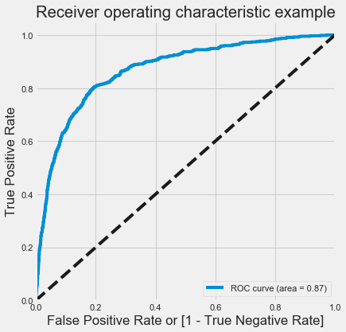


    ModelName: adaboost_default | time (training/test) = 122.733s/0.603s


<div>
<style scoped>
    .dataframe tbody tr th:only-of-type {
        vertical-align: middle;
    }

    .dataframe tbody tr th {
        vertical-align: top;
    }

    .dataframe thead th {
        text-align: right;
    }
</style>
<table border="1" class="dataframe">
  <thead>
    <tr style="text-align: right;">
      <th></th>
      <th>name</th>
      <th>train_accuracy</th>
      <th>train_precision</th>
      <th>train_recall</th>
      <th>train_f1</th>
      <th>train_auc</th>
      <th>test_accuracy</th>
      <th>test_precision</th>
      <th>test_recall</th>
      <th>test_f1</th>
      <th>test_auc</th>
    </tr>
  </thead>
  <tbody>
    <tr>
      <td>0</td>
      <td>adaboost_default</td>
      <td>0.8917</td>
      <td>0.8838</td>
      <td>0.9019</td>
      <td>0.8928</td>
      <td>0.9583</td>
      <td>0.8460</td>
      <td>0.3024</td>
      <td>0.7231</td>
      <td>0.4265</td>
      <td>0.8681</td>
    </tr>
  </tbody>
</table>
</div>


### Hyperparameter tuning

This hyper parameter tuning for AdaBoost Classifier takes around **15** minutes on a machine with 32 GB ram and 12 processor


```python
param_grid = {
    "base_estimator__max_depth": [2, 4],
    "n_estimators": [200, 300],
    "learning_rate": [.3, .9, .3]
}

tree = DecisionTreeClassifier(random_state=random_seed)

ABC = AdaBoostClassifier(base_estimator=tree, algorithm="SAMME")

hyperparameter_tuning(ABC, param_grid, 3, 'roc_auc')
```

    Fitting 3 folds for each of 12 candidates, totalling 36 fits


    [Parallel(n_jobs=-1)]: Using backend LokyBackend with 12 concurrent workers.
    [Parallel(n_jobs=-1)]: Done  36 out of  36 | elapsed: 15.0min finished


    AdaBoostClassifier(algorithm='SAMME',
                       base_estimator=DecisionTreeClassifier(max_depth=4),
                       learning_rate=0.9, n_estimators=300)


```python
weak_learner = DecisionTreeClassifier(max_depth=4, random_state=random_seed)

adaboost = AdaBoostClassifier(base_estimator=weak_learner,
                              n_estimators=300,
                              learning_rate=0.9,
                              algorithm="SAMME")

df = train_model('adaboost_tuned', adaboost, X_train_pca, y_train_smote,
                 X_test_pca, y_test)
model_metrics = pd.concat([model_metrics, df], axis=0)
df
```


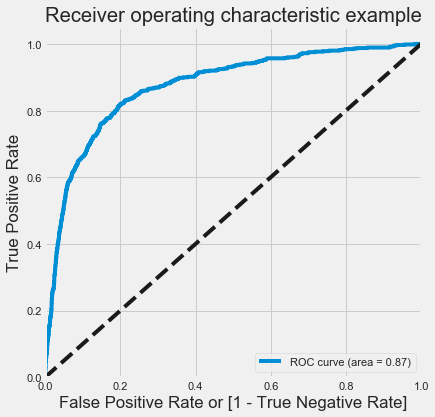


    ModelName: adaboost_tuned  | time (training/test) = 327.726s/0.807s


<div>
<style scoped>
    .dataframe tbody tr th:only-of-type {
        vertical-align: middle;
    }

    .dataframe tbody tr th {
        vertical-align: top;
    }

    .dataframe thead th {
        text-align: right;
    }
</style>
<table border="1" class="dataframe">
  <thead>
    <tr style="text-align: right;">
      <th></th>
      <th>name</th>
      <th>train_accuracy</th>
      <th>train_precision</th>
      <th>train_recall</th>
      <th>train_f1</th>
      <th>train_auc</th>
      <th>test_accuracy</th>
      <th>test_precision</th>
      <th>test_recall</th>
      <th>test_f1</th>
      <th>test_auc</th>
    </tr>
  </thead>
  <tbody>
    <tr>
      <td>0</td>
      <td>adaboost_tuned</td>
      <td>0.9807</td>
      <td>0.9700</td>
      <td>0.9921</td>
      <td>0.9809</td>
      <td>0.9988</td>
      <td>0.8939</td>
      <td>0.3945</td>
      <td>0.6354</td>
      <td>0.4867</td>
      <td>0.8730</td>
    </tr>
  </tbody>
</table>
</div>


## Gradient Boosting Classifier


```python
GBC = GradientBoostingClassifier(max_depth=2, n_estimators=200, random_state=random_seed)
df = train_model('gradient_boost_default', GBC, X_train_pca, y_train_smote,
                 X_test_pca, y_test)
model_metrics = pd.concat([model_metrics, df], axis=0)
df
```


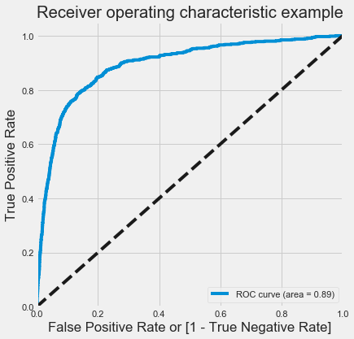


    ModelName: gradient_boost_default | time (training/test) = 108.928s/0.232s


<div>
<style scoped>
    .dataframe tbody tr th:only-of-type {
        vertical-align: middle;
    }

    .dataframe tbody tr th {
        vertical-align: top;
    }

    .dataframe thead th {
        text-align: right;
    }
</style>
<table border="1" class="dataframe">
  <thead>
    <tr style="text-align: right;">
      <th></th>
      <th>name</th>
      <th>train_accuracy</th>
      <th>train_precision</th>
      <th>train_recall</th>
      <th>train_f1</th>
      <th>train_auc</th>
      <th>test_accuracy</th>
      <th>test_precision</th>
      <th>test_recall</th>
      <th>test_f1</th>
      <th>test_auc</th>
    </tr>
  </thead>
  <tbody>
    <tr>
      <td>0</td>
      <td>gradient_boost_default</td>
      <td>0.8708</td>
      <td>0.8679</td>
      <td>0.8746</td>
      <td>0.8712</td>
      <td>0.9389</td>
      <td>0.8498</td>
      <td>0.3197</td>
      <td>0.7954</td>
      <td>0.4561</td>
      <td>0.8918</td>
    </tr>
  </tbody>
</table>
</div>


### Hyperparameter tuning

This hyper parameter tuning for Gradient Boosting Classifier takes around **4** minutes on a machine with 32 GB ram and 12 processor


```python
param_grid = {"learning_rate": [0.2, 0.6, 0.9], "subsample": [0.3, 0.6, 0.9]}
GBC = GradientBoostingClassifier(max_depth=2,
                                 n_estimators=200,
                                 random_state=random_seed)
hyperparameter_tuning(GBC, param_grid, n_folds=3)
```

    Fitting 3 folds for each of 9 candidates, totalling 27 fits


    [Parallel(n_jobs=-1)]: Using backend LokyBackend with 12 concurrent workers.
    [Parallel(n_jobs=-1)]: Done  27 out of  27 | elapsed:  3.3min finished


    GradientBoostingClassifier(learning_rate=0.9, max_depth=2, n_estimators=200,
                               subsample=0.9)


```python
GBC = GradientBoostingClassifier(max_depth=2,
                                 n_estimators=200,
                                 learning_rate=0.9,
                                 subsample=0.9,
                                 random_state=random_seed)
df = train_model('gradient_boost_tuned', GBC, X_train_pca, y_train_smote,
                 X_test_pca, y_test)
model_metrics = pd.concat([model_metrics, df], axis=0)
df
```


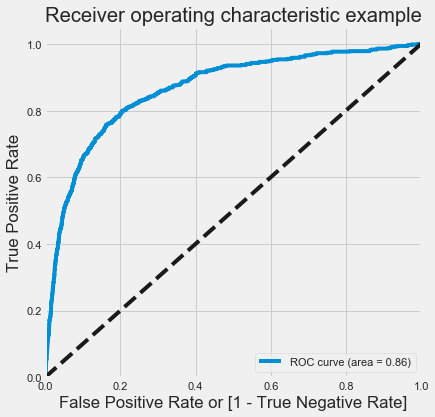


    ModelName: gradient_boost_tuned | time (training/test) = 95.782s/0.251s


<div>
<style scoped>
    .dataframe tbody tr th:only-of-type {
        vertical-align: middle;
    }

    .dataframe tbody tr th {
        vertical-align: top;
    }

    .dataframe thead th {
        text-align: right;
    }
</style>
<table border="1" class="dataframe">
  <thead>
    <tr style="text-align: right;">
      <th></th>
      <th>name</th>
      <th>train_accuracy</th>
      <th>train_precision</th>
      <th>train_recall</th>
      <th>train_f1</th>
      <th>train_auc</th>
      <th>test_accuracy</th>
      <th>test_precision</th>
      <th>test_recall</th>
      <th>test_f1</th>
      <th>test_auc</th>
    </tr>
  </thead>
  <tbody>
    <tr>
      <td>0</td>
      <td>gradient_boost_tuned</td>
      <td>0.9336</td>
      <td>0.9197</td>
      <td>0.9502</td>
      <td>0.9347</td>
      <td>0.9779</td>
      <td>0.8654</td>
      <td>0.3316</td>
      <td>0.6892</td>
      <td>0.4478</td>
      <td>0.8641</td>
    </tr>
  </tbody>
</table>
</div>


## XGBoost


```python
xgb = XGBClassifier(max_depth=2,
                    n_estimators=200,
                    nthread=-1,
                    random_state=random_seed)
df = train_model('xgboost_default', xgb, X_train_pca, y_train_smote,
                 X_test_pca, y_test)
model_metrics = pd.concat([model_metrics, df], axis=0)
df
```


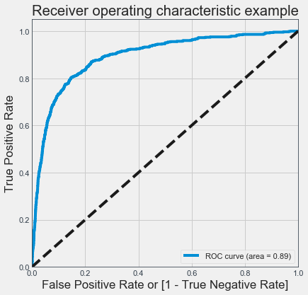


    ModelName: xgboost_default | time (training/test) = 30.616s/0.376s


<div>
<style scoped>
    .dataframe tbody tr th:only-of-type {
        vertical-align: middle;
    }

    .dataframe tbody tr th {
        vertical-align: top;
    }

    .dataframe thead th {
        text-align: right;
    }
</style>
<table border="1" class="dataframe">
  <thead>
    <tr style="text-align: right;">
      <th></th>
      <th>name</th>
      <th>train_accuracy</th>
      <th>train_precision</th>
      <th>train_recall</th>
      <th>train_f1</th>
      <th>train_auc</th>
      <th>test_accuracy</th>
      <th>test_precision</th>
      <th>test_recall</th>
      <th>test_f1</th>
      <th>test_auc</th>
    </tr>
  </thead>
  <tbody>
    <tr>
      <td>0</td>
      <td>xgboost_default</td>
      <td>0.8702</td>
      <td>0.8667</td>
      <td>0.8751</td>
      <td>0.8709</td>
      <td>0.9386</td>
      <td>0.8528</td>
      <td>0.3245</td>
      <td>0.7938</td>
      <td>0.4607</td>
      <td>0.8923</td>
    </tr>
  </tbody>
</table>
</div>


### Hyperparameter tuning

This hyper parameter tuning for XGBoostClassifier takes around **9** minutes on a machine with 32 GB ram and 12 processor


```python
param_grid = {
    "learning_rate": [0.1, 0.2, 0.3],
    "subsample": [0.3, 0.6, 0.9],
    'n_estimators': [200, 400, 600]
}
xgb = XGBClassifier(max_depth=2,
                    n_estimators=200,
                    nthread=-1,
                    random_state=random_seed)
hyperparameter_tuning(xgb, param_grid, n_folds=3)
```

    Fitting 3 folds for each of 27 candidates, totalling 81 fits


    [Parallel(n_jobs=-1)]: Using backend LokyBackend with 12 concurrent workers.
    [Parallel(n_jobs=-1)]: Done  26 tasks      | elapsed:  2.8min
    [Parallel(n_jobs=-1)]: Done  81 out of  81 | elapsed:  8.9min finished


    XGBClassifier(learning_rate=0.3, max_depth=2, n_estimators=600, nthread=-1,
                  random_state=101, subsample=0.9)


```python
xgb = XGBClassifier(max_depth=2,
                    n_estimators=600,
                    nthread=-1,
                    learning_rate=0.3,
                    subsample=0.9)

df = train_model('xgboost_tuned', xgb, X_train_pca, y_train_smote,
                 X_test_pca, y_test)
model_metrics = pd.concat([model_metrics, df], axis=0)
df
```


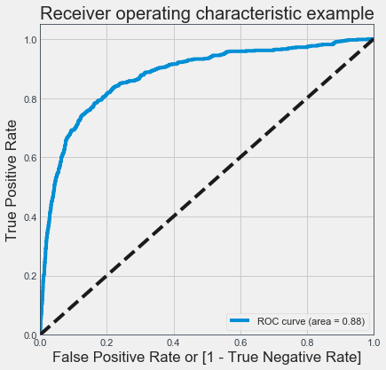


    ModelName: xgboost_tuned   | time (training/test) = 85.784s/0.388s


<div>
<style scoped>
    .dataframe tbody tr th:only-of-type {
        vertical-align: middle;
    }

    .dataframe tbody tr th {
        vertical-align: top;
    }

    .dataframe thead th {
        text-align: right;
    }
</style>
<table border="1" class="dataframe">
  <thead>
    <tr style="text-align: right;">
      <th></th>
      <th>name</th>
      <th>train_accuracy</th>
      <th>train_precision</th>
      <th>train_recall</th>
      <th>train_f1</th>
      <th>train_auc</th>
      <th>test_accuracy</th>
      <th>test_precision</th>
      <th>test_recall</th>
      <th>test_f1</th>
      <th>test_auc</th>
    </tr>
  </thead>
  <tbody>
    <tr>
      <td>0</td>
      <td>xgboost_tuned</td>
      <td>0.9446</td>
      <td>0.9268</td>
      <td>0.9653</td>
      <td>0.9457</td>
      <td>0.9846</td>
      <td>0.8768</td>
      <td>0.3589</td>
      <td>0.7062</td>
      <td>0.4759</td>
      <td>0.8774</td>
    </tr>
  </tbody>
</table>
</div>


## Model evaluation


```python
model_metrics
```


<div>
<style scoped>
    .dataframe tbody tr th:only-of-type {
        vertical-align: middle;
    }

    .dataframe tbody tr th {
        vertical-align: top;
    }

    .dataframe thead th {
        text-align: right;
    }
</style>
<table border="1" class="dataframe">
  <thead>
    <tr style="text-align: right;">
      <th></th>
      <th>name</th>
      <th>train_accuracy</th>
      <th>train_precision</th>
      <th>train_recall</th>
      <th>train_f1</th>
      <th>train_auc</th>
      <th>test_accuracy</th>
      <th>test_precision</th>
      <th>test_recall</th>
      <th>test_f1</th>
      <th>test_auc</th>
    </tr>
  </thead>
  <tbody>
    <tr>
      <td>0</td>
      <td>logistic_regression</td>
      <td>0.8477</td>
      <td>0.8349</td>
      <td>0.8668</td>
      <td>0.8506</td>
      <td>0.9157</td>
      <td>0.8235</td>
      <td>0.2874</td>
      <td>0.8308</td>
      <td>0.4270</td>
      <td>0.8967</td>
    </tr>
    <tr>
      <td>0</td>
      <td>logistic_regression</td>
      <td>0.8477</td>
      <td>0.8349</td>
      <td>0.8668</td>
      <td>0.8506</td>
      <td>0.9157</td>
      <td>0.8235</td>
      <td>0.2874</td>
      <td>0.8308</td>
      <td>0.4270</td>
      <td>0.8967</td>
    </tr>
    <tr>
      <td>0</td>
      <td>logistic_regression</td>
      <td>0.8477</td>
      <td>0.8349</td>
      <td>0.8668</td>
      <td>0.8506</td>
      <td>0.9157</td>
      <td>0.8235</td>
      <td>0.2874</td>
      <td>0.8308</td>
      <td>0.4270</td>
      <td>0.8967</td>
    </tr>
    <tr>
      <td>0</td>
      <td>logistic_regression</td>
      <td>0.8477</td>
      <td>0.8349</td>
      <td>0.8668</td>
      <td>0.8506</td>
      <td>0.9157</td>
      <td>0.8235</td>
      <td>0.2874</td>
      <td>0.8308</td>
      <td>0.4270</td>
      <td>0.8967</td>
    </tr>
    <tr>
      <td>0</td>
      <td>logistic_regression</td>
      <td>0.8477</td>
      <td>0.8349</td>
      <td>0.8668</td>
      <td>0.8506</td>
      <td>0.9157</td>
      <td>0.8235</td>
      <td>0.2874</td>
      <td>0.8308</td>
      <td>0.4270</td>
      <td>0.8967</td>
    </tr>
    <tr>
      <td>0</td>
      <td>gradient_boost_default</td>
      <td>0.8708</td>
      <td>0.8679</td>
      <td>0.8746</td>
      <td>0.8712</td>
      <td>0.9389</td>
      <td>0.8498</td>
      <td>0.3197</td>
      <td>0.7954</td>
      <td>0.4561</td>
      <td>0.8918</td>
    </tr>
    <tr>
      <td>0</td>
      <td>random_forest_default</td>
      <td>0.8766</td>
      <td>0.8756</td>
      <td>0.8779</td>
      <td>0.8768</td>
      <td>0.9436</td>
      <td>0.8492</td>
      <td>0.3113</td>
      <td>0.7462</td>
      <td>0.4393</td>
      <td>0.8771</td>
    </tr>
    <tr>
      <td>0</td>
      <td>random_forest_tuned</td>
      <td>0.8225</td>
      <td>0.8389</td>
      <td>0.7984</td>
      <td>0.8181</td>
      <td>0.9030</td>
      <td>0.8311</td>
      <td>0.2820</td>
      <td>0.7323</td>
      <td>0.4072</td>
      <td>0.8628</td>
    </tr>
    <tr>
      <td>0</td>
      <td>gradient_boost_tuned</td>
      <td>0.9233</td>
      <td>0.9096</td>
      <td>0.9401</td>
      <td>0.9246</td>
      <td>0.9730</td>
      <td>0.8637</td>
      <td>0.3338</td>
      <td>0.7246</td>
      <td>0.4571</td>
      <td>0.8735</td>
    </tr>
    <tr>
      <td>0</td>
      <td>adaboost_default</td>
      <td>0.8917</td>
      <td>0.8838</td>
      <td>0.9019</td>
      <td>0.8928</td>
      <td>0.9583</td>
      <td>0.8460</td>
      <td>0.3024</td>
      <td>0.7231</td>
      <td>0.4265</td>
      <td>0.8681</td>
    </tr>
    <tr>
      <td>0</td>
      <td>decision_tree</td>
      <td>0.8479</td>
      <td>0.8521</td>
      <td>0.8418</td>
      <td>0.8469</td>
      <td>0.9110</td>
      <td>0.8291</td>
      <td>0.2768</td>
      <td>0.7185</td>
      <td>0.3997</td>
      <td>0.8350</td>
    </tr>
    <tr>
      <td>0</td>
      <td>decision_tree_default</td>
      <td>0.8479</td>
      <td>0.8521</td>
      <td>0.8418</td>
      <td>0.8469</td>
      <td>0.9110</td>
      <td>0.8291</td>
      <td>0.2768</td>
      <td>0.7185</td>
      <td>0.3997</td>
      <td>0.8350</td>
    </tr>
    <tr>
      <td>0</td>
      <td>decision_tree_tuned</td>
      <td>0.8641</td>
      <td>0.8565</td>
      <td>0.8746</td>
      <td>0.8655</td>
      <td>0.9441</td>
      <td>0.8185</td>
      <td>0.2630</td>
      <td>0.7169</td>
      <td>0.3848</td>
      <td>0.8425</td>
    </tr>
    <tr>
      <td>0</td>
      <td>decision_tree_tuned</td>
      <td>0.8641</td>
      <td>0.8565</td>
      <td>0.8746</td>
      <td>0.8655</td>
      <td>0.9441</td>
      <td>0.8185</td>
      <td>0.2630</td>
      <td>0.7169</td>
      <td>0.3848</td>
      <td>0.8425</td>
    </tr>
    <tr>
      <td>0</td>
      <td>gradient_boost_tuned</td>
      <td>0.9336</td>
      <td>0.9197</td>
      <td>0.9502</td>
      <td>0.9347</td>
      <td>0.9779</td>
      <td>0.8654</td>
      <td>0.3316</td>
      <td>0.6892</td>
      <td>0.4478</td>
      <td>0.8641</td>
    </tr>
    <tr>
      <td>0</td>
      <td>adaboost_tuned</td>
      <td>0.9807</td>
      <td>0.9700</td>
      <td>0.9921</td>
      <td>0.9809</td>
      <td>0.9988</td>
      <td>0.8939</td>
      <td>0.3945</td>
      <td>0.6354</td>
      <td>0.4867</td>
      <td>0.8730</td>
    </tr>
    <tr>
      <td>0</td>
      <td>base_line</td>
      <td>0.5006</td>
      <td>0.5006</td>
      <td>0.5004</td>
      <td>0.5005</td>
      <td>0.5006</td>
      <td>0.5011</td>
      <td>0.0785</td>
      <td>0.4938</td>
      <td>0.1355</td>
      <td>0.4978</td>
    </tr>
    <tr>
      <td>0</td>
      <td>xgboost_default</td>
      <td>0.8702</td>
      <td>0.8667</td>
      <td>0.8751</td>
      <td>0.8709</td>
      <td>0.9386</td>
      <td>0.8528</td>
      <td>0.3245</td>
      <td>0.7938</td>
      <td>0.4607</td>
      <td>0.8923</td>
    </tr>
    <tr>
      <td>0</td>
      <td>xgboost_default</td>
      <td>0.8702</td>
      <td>0.8667</td>
      <td>0.8751</td>
      <td>0.8709</td>
      <td>0.9386</td>
      <td>0.8528</td>
      <td>0.3245</td>
      <td>0.7938</td>
      <td>0.4607</td>
      <td>0.8923</td>
    </tr>
    <tr>
      <td>0</td>
      <td>xgboost_tuned</td>
      <td>0.9351</td>
      <td>0.9200</td>
      <td>0.9532</td>
      <td>0.9363</td>
      <td>0.9797</td>
      <td>0.8676</td>
      <td>0.3361</td>
      <td>0.6892</td>
      <td>0.4518</td>
      <td>0.8679</td>
    </tr>
    <tr>
      <td>0</td>
      <td>xgboost_tuned</td>
      <td>0.9446</td>
      <td>0.9268</td>
      <td>0.9653</td>
      <td>0.9457</td>
      <td>0.9846</td>
      <td>0.8768</td>
      <td>0.3589</td>
      <td>0.7062</td>
      <td>0.4759</td>
      <td>0.8774</td>
    </tr>
  </tbody>
</table>
</div>


```python
model_metrics = model_metrics.sort_values(by='test_recall', ascending=False)
sns.barplot(model_metrics['name'],
            model_metrics['test_recall'],
            palette='Greens_d')
plt.xticks(rotation=30, horizontalalignment="center")
plt.title("Model recall")
plt.xlabel("Model")
plt.ylabel("Recall")
```


    Text(0, 0.5, 'Recall')


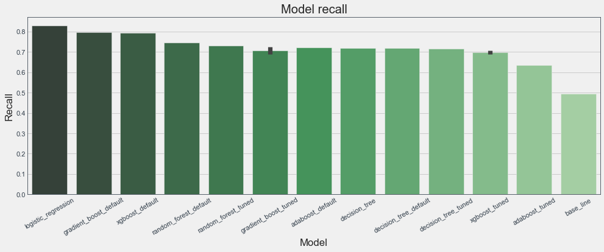


In this problem, data points corresponding to the target class is very less in number. Thus max `recall` will be the metrics which we will be targeting for. **We want to reduce *Type 2* error which *False Negative*.**

We created baseline model which always selected a single class. This model resulted in a recall value of around **.50**. 

As we can see from the above chart and the table that the ***Logistic Regression*** has the best *recall* value of ***0.83***. Default ***Gradient Boost Classifier*** has the next best *recall* value of ***0.79***. Other boosting classifiers worked well on the training data however, performed poorly on the test data.

Thus we will be selecting ***Logistic Regression*** as our final classifier

# Important features for churn

As suggested in the problem statement, we can either use *Logistic Regression* or *Random Forest* to identify the most important features. We will be using ***Random Forest*** as we need not handle multi collinearity of the features. 


```python
param_grid = {
    'max_depth': range(4, 12, 4),
    'min_samples_leaf': range(50, 200, 50),
    'min_samples_split': range(50, 200, 50),
    'n_estimators': range(100, 500, 100),
    'max_features': range(5, 20, 5)
}
hyperparameter_tuning(RandomForestClassifier(),
                      param_grid,
                      n_folds=3,
                      X_train=X_train_smote)
```

    Fitting 3 folds for each of 216 candidates, totalling 648 fits


    [Parallel(n_jobs=-1)]: Using backend LokyBackend with 12 concurrent workers.
    [Parallel(n_jobs=-1)]: Done  26 tasks      | elapsed:   28.7s
    [Parallel(n_jobs=-1)]: Done 176 tasks      | elapsed:  4.2min


```python

```
